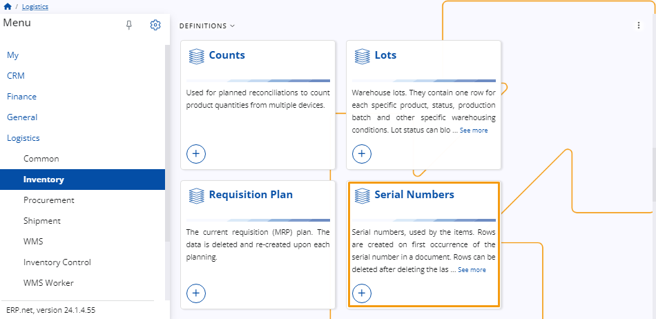

# Inventory 

Inventory is designed to assist you in the process of inventory control and warehouse management.

It includes the ability to **create** store orders, reconciliation documents, and transfer orders, including their respective invoices. 

You can further take advantage of Inventory's simplified **[Inventory Control](inventory-control/index.md)** application, designed to assist and speed up operations within shops and smaller stores.

## Documents

#### Transactions 

In this panel, you can find all transaction documents related to **movements** in and out of your warehouse’s existing stores. 

**Receipt transactions** reflect incoming goods, while **issue store transactions** denote outgoing goods. 

Transactions are always created as a result of a **store order**.

 
#### Transfer Orders 

This panel allows for the creation of documents reflecting product quantities which you **move** from one of your existing stores to another.

It's an essential part of inventory management and leads to the creation of a receipt transaction for the receiving store and an issue store transaction for the sending store.

 
#### Reconciliations

In this panel, you can create documents to **update** your warehouse or store's current availability. 

It allows for the creation of receipt store transactions (+) and issue store transactions (-) based on variations between initially counted quantities and actual availability.

 
## Definitions 

#### Stores 

This panel allows you to define virtual representations of the physical **stores** of your warehouse.

To utilize all capabilities of **Inventory**, you must define at least one store.

 
#### Lots

Warehouse **lots** consist of individual entries for each distinct product, detailing its status, production batch, and specific warehouse conditions. 

The status of each lot can restrict certain operations within the warehouse.

 
#### Serial Numbers 

These are assigned to items and tracked within documents. 

Each serial number generates a unique entry upon its initial occurrence in a document. 

These entries can be removed once the last occurrence of the serial number is deleted from the document.

 
#### Requisition Plan

You have the option to assign a current requisition (MRP) plan, which is designed to maintain optimal inventory levels to meet demand while minimizing excess stock and associated costs. 

This plan involves resetting and regenerating data during each planning cycle.

 

## Views 

The **Availability to Promise** view provides quantities available for various date periods, including current and projected availability.

The **Availability to Promise by Lot** view specifically tracks quantities available for different date periods, considering both current and projected availability, with a focus on individual lot quantities and those without lot specifications.

Learn more about **Inventory** in the following articles:
 
- **[Execute store orders function](https://docs.erp.net/tech/modules/logistics/inventory/execute-store-orders-function/index.html?q=Execute%20store%20orders%20function)**

- **[Lots](https://docs.erp.net/tech/modules/logistics/inventory/lots/index.html?q=Lots)**

- **[Store orders](https://docs.erp.net/tech/modules/logistics/inventory/store-orders/index.html?q=Store%20orders)**

- **[Available to promise](https://docs.erp.net/tech/modules/logistics/inventory/available-to-promise/index.html)**

- **[Projected availability report](https://docs.erp.net/tech/modules/logistics/inventory/projected-availability-report.html?q=Projected%20availability%20report)**

- **[Receipt and issue balance validation in store transfers](https://docs.erp.net/tech/modules/logistics/inventory/receipt-and-issue-balance-validation-in-store-transfers.html?q=Receipt%20and%20issue%20balance%20validation%20in%20store%20transfers)**

- **[Inventory Control](inventory-control/index.md)**

> [!NOTE]
> 
> The screenshots taken for this article are from v24 of the platform.
