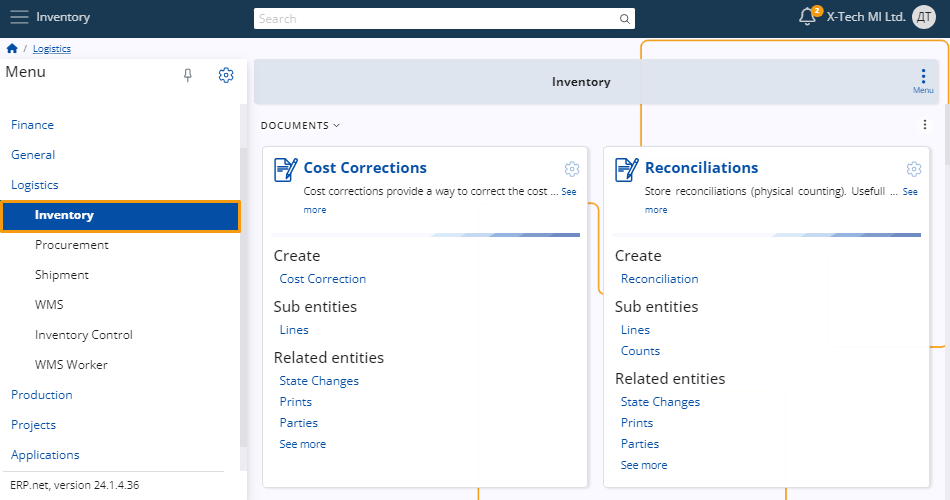

# Inventory 

Inventory is designed to assist you in the process of inventory control and warehouse management.

It includes the ability to **create** various invoices, reconciliation documents and transfer orders, add **definitions** and utilize different **views**.

## Documents

#### Transactions 

In **Transaction** you can find the receipts for the Stores. **Store-Receipts** reflect incoming goods, while **Store-Issues** denote outgoing goods. 

Outgoing goods in Store-Issues are recorded with negative quantity values. Based on a **Purchase Order**, a receipt is generated. 

 
#### Transfer Orders 

Orders for stock transfers between stores.

 
#### Reconciliations

In **Reconciliations**, you can manage your stock numbers. Based on variations between recorded stock levels and actual availability, **Store-Receipts** or **Store-Issues** are generated.

 
## Definitions 

#### Stores 

**Stores** represent the physical warehouses within your inventory management system. To utilize the inventory, you must define one or more stores to house your inventory.

 
#### Lots

Warehouse lots consist of individual entries for each distinct product, detailing its status, production batch, and specific warehouse conditions. 

The status of each lot can restrict certain operations within the warehouse.

 
#### Serial Numbers 

**Serial numbers** are assigned to items and tracked within documents. 

Each serial number generates a unique entry upon its initial occurrence in a document. 

These entries can be removed once the last occurrence of the serial number is deleted from the document.

 
#### Requisition Plan

You have the option to assign the current requisition (MRP) plan, which is designed to maintain optimal inventory levels to meet demand while minimizing excess stock and associated costs. 

This plan involves resetting and regenerating data during each planning cycle.

 

## Views 

#### Available To Promise and Available To Promise By Lots

**The Availability to Promise** feature provides quantities available for various date periods, including current and projected availability, while the **Availability to Promise by Lot** feature specifically tracks 
quantities available for different date periods, considering both current and projected availability, with a focus on individual lot quantities and those without lot specifications.

Learn more about Inventory in the following articles:
 
- **[Execute store orders function](https://docs.erp.net/tech/modules/logistics/inventory/execute-store-orders-function/index.html?q=Execute%20store%20orders%20function)**

- **[Lots](https://docs.erp.net/tech/modules/logistics/inventory/lots/index.html?q=Lots)**

- **[Store orders](https://docs.erp.net/tech/modules/logistics/inventory/store-orders/index.html?q=Store%20orders)**

- **[Available to promise](https://docs.erp.net/tech/modules/logistics/inventory/available-to-promise/index.html)**

- **[Projected availability report](https://docs.erp.net/tech/modules/logistics/inventory/projected-availability-report.html?q=Projected%20availability%20report)**

- **[Receipt and issue balance validation in store transfers](https://docs.erp.net/tech/modules/logistics/inventory/receipt-and-issue-balance-validation-in-store-transfers.html?q=Receipt%20and%20issue%20balance%20validation%20in%20store%20transfers)**

- **[Inventory Control](inventory-control/index.md)**
