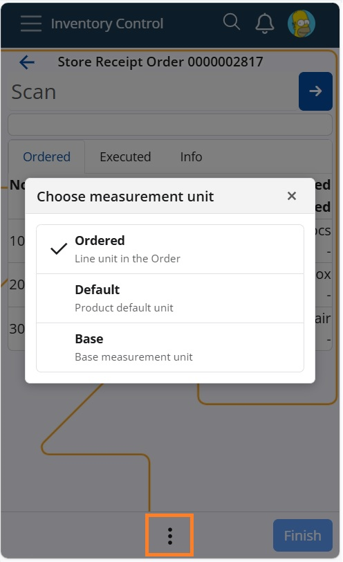
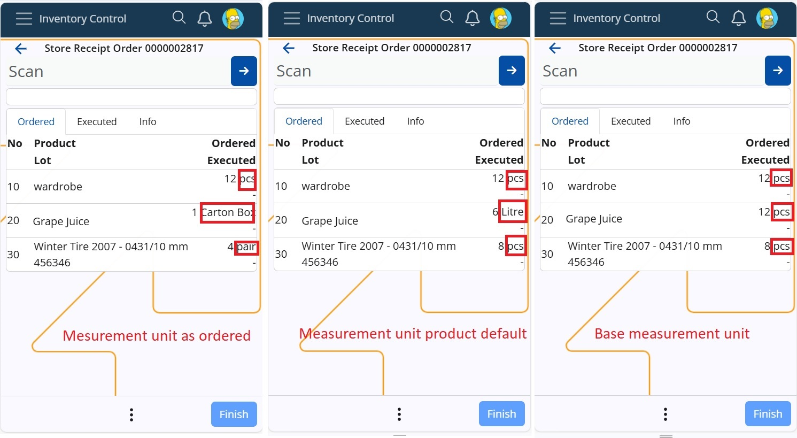
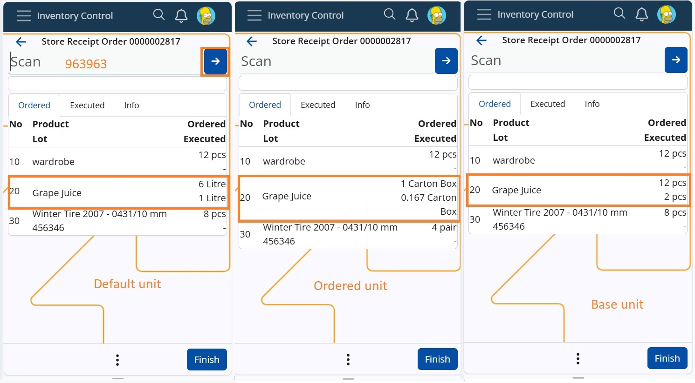
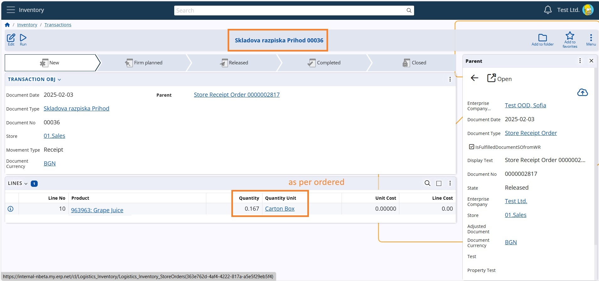

# Measurement unit of the order #
The store order can be created using different measurement units for the "Quantity Unit" field, even for the same product. These units could include kg, packet, carton box, liter, pcs, bulk, bottle, and more. To ease the process for users, the "Choose Measurement Unit" menu is available within the order. Its main purpose is to make the order execution more user-friendly and help streamline the counting of various storage and distribution units.

## How it works? ##
The menu is available for operations Receive and Issue. 
The settings are remembered per user and independently for the forementioned operations.

A user initiates a Receive operation for an Order. By default, the order lines are displayed in the ordered measurement units unless changed.
In the example below, a Receive order includes three lines for products ordered in different measurement units.

Product "Grape Juice" has a default measurement unit of "Litre" but is currently ordered in "Carton box." The conversion is as follows: 1 Carton box = 6 Litres = 12 pcs (Base unit).

When scanning 1 unit of "Grape Juice" (code: 963963), the system correctly recalculates the quantity using the ratio relative to the base measurement unit. This results in a recorded quantity of 1/6 of a Carton box (0.167) or 2 pcs (Base unit).

By changing the display measurement unit through the menu, the ordered quantities are recalculated based on the product dimensions and predefined conversion ratios.

During order execution, users can switch between measurement units for convenience.

Upon order completion, the Store transaction is recorded in the originally ordered measurement units.

With this innovation, workers can scan and process different units of the same product effortlessly, making inventory management more adaptable, efficient, and user-friendly. Try it out today and experience a new level of control over your operations!
