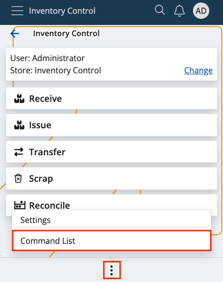
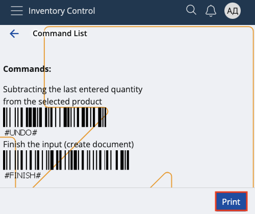

# Command list

Here, you can find various **barcodes** which help you add quantities and apply different commands **instantly**.

This can be handy for adding multiple instances of a product or performing certain operations like creating a document.

### Navigation

In order to access the Command list, tap on the **three-dot button** at the bottom of the screen and select **Command List**.

All barcodes are grouped into **Quantities** and **Commands**, and each group features short explanations on what its barcodes will achieve.

While quantity barcodes immediately scan a fixed amount of **instances** of a product, commands execute specific **operations**.

At any time, you can print and use this sheet externally with the help of the **Print** button.

Simply scan a barcode and your desired operation will be reflected immediately, without the need to type anything.

