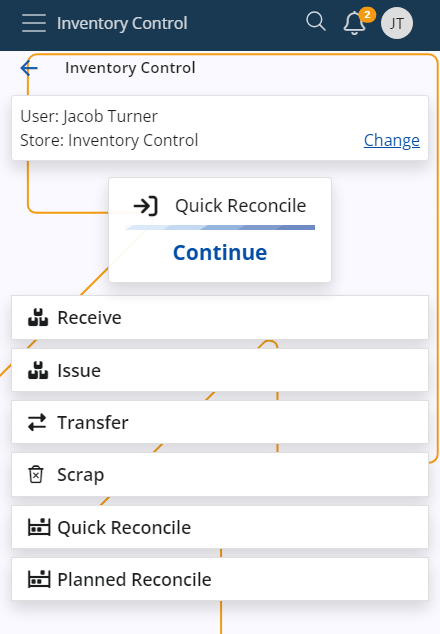
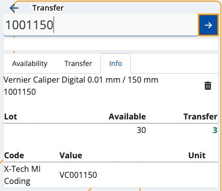
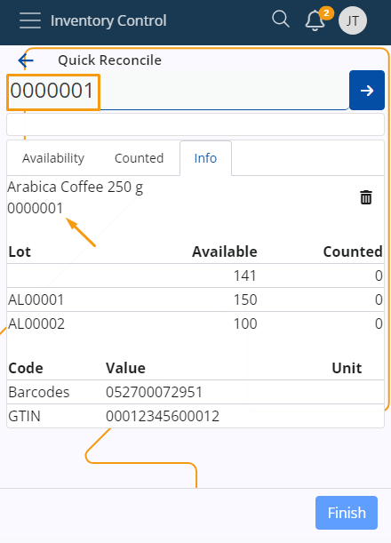
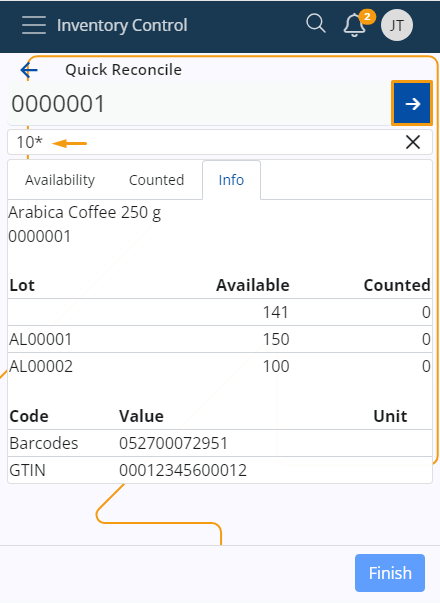
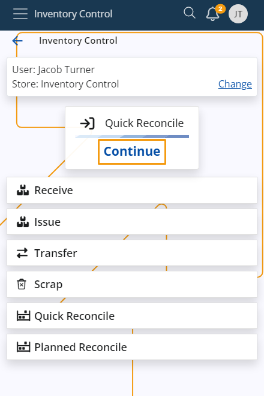
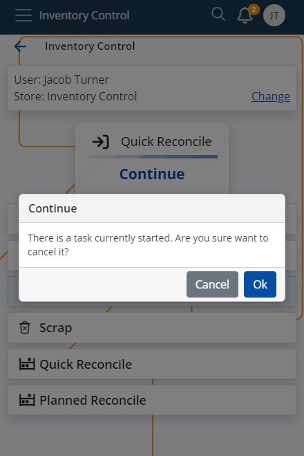

# Inventory Control

Inventory Control is a mobile inventory management application designed to speed up and simplify basic operations with store orders. It's perfectly suitable for shops and smaller stores.

It follows a similar logic to the **BarCodeCommand** panel from within the **Desktop Client**, but much simpler. It works only with a simple barcodes and allows workers to complete their daily tasks quickly, without going through the more complex procedures of the **[WMS module](/modules/logistics/wms/wms-worker/index.md)**. 

You can **receive**, **issue**, **reconcile**, **transfer** and **scrap** orders in just a few steps. These actions are **not** synchronized in real-time with the ERP.net system - you need to create the respective receipt transaction, issue transaction, transfer order, and reconciliation documents in order to reflect them. 

### Prerequisites

Before you start using Inventory Control, you'll be prompted to select the **store** for which you want to perform different operations.

That store will be saved for follow-up operations but can easily be switched to a different one with the help of the **Change** button.

## Common features

Here, you can observe the most commonly used features in the **Inventory Control** panel.

### Scanning

In order to scan your products manually, you need to use the **Scan** field.

It lets you quickly insert the instances of a product you want to add either manually or through barcode commands.

For a list of available barcode templates, check out the **[Command list](command-list.md)**.

### Individual scan

Simply type in a product's code once (e.g. "0000001") in order to add only one pcs of it. Tap the **blue arrow** to confirm.

Every time you scan, you'll be taken to the **Info** tab for the respective product. 

Successfully scaned pcs are painted in **green**.

If more lots are present for a product, the FEFO principle determines which lot has pcs add first.

Incorrect product codes will generate an error. 

### Multiple scans

To scan more pcs or the exact number of pcs for a product, specify it first (e.g. "50"), add a "*", and then enter the product code.

This can be done on one line (e.g. 50*1001150), or on two separate lines for each input. Tap the **blue arrow** to confirm.

> [!NOTE]
> 1. The **trash bin button** allows you to remove the latest operation, which will restore the previous operation value.
> 2. Any one, two or three-number combination is automatically counted as a **multiplier**. You can insert it without adding "*" in the end.
> 3. You can remove inserted multipliers by tapping the **Clear button (X)**.

### Zero count

If you enter a zero quantity in the **Scan** field, all of the entered quantities before will be set to **zero**.

### Select a product from the Info tab

You also have the option to enter a product's code only by tapping on its code within the **Info** tab. 

When you do that, the product code will be automatically entered in the **Scan** field.

If you need to scan **multiple** quantities of your product, you can provide a quantity into the Scan field.

Once you tap on the product's code, you can enter **all** of the quantities at once.

### Continue last started operation

Inventory Control allows you to **resume** the last operation you were performing. 

If you exited a receive operation mid-way, for example, it will be displayed as a **shortcut** in the main menu. 

You can tap the **Continue** button to proceed with it.

If you choose to begin a new operation **before** completing the latest one, a **warning** will appear, asking you to confirm the termination of the latest operation.

>[!NOTE]

>If in the middle of the execution you decide to change Language, Company or Location from the User menu, you will be taken to the initial IC screen with no progress saved.

Learn more about Inventory Control in the following articles:

* **[Settings](settings.md)**
*	**[Receive](receive.md)**
*	**[Issue](issue.md)**
*	**[Reconcile](reconcile.md)**
*	**[Transfer](transfer.md)**
*	**[Scrap](scrap.md)**
*	**[Command list](command-list.md)**

> [!NOTE]
> 
> The screenshots taken for this article are from v24 of the platform.

