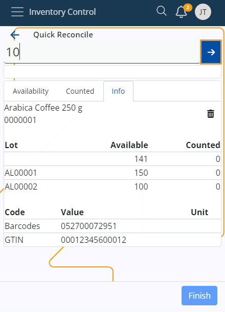
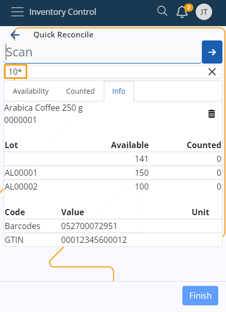
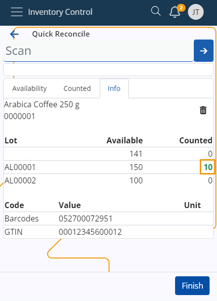

# Inventory Control

Inventory Control is a mobile inventory management application designed to speed up and simplify basic operations with store orders. It's perfectly suitable for shops and smaller stores.

It follows a similar logic to the **BarCodeCommand** panel from within the **Desktop Client** and allows workers to complete their daily tasks quickly, without going through the more complex procedures of the **[WMS module](/modules/logistics/wms/wms-worker/index.md)**. 

You can **receive**, **issue**, **reconcile**, **transfer** and **scrap** orders in just a few steps. These actions are **not** synchronized in real-time with the ERP.net system - you need to create the respective receipt transaction, issue transaction, transfer order, and reconciliation documents in order to reflect them. 

### Prerequisites

Before you start using Inventory Control, you'll be prompted to select the **store** for which you want to perform different operations.

That store will be saved for follow-up operations but can easily be switched to a different one with the help of the **Change** button.

## Common features

Here, you can observe the most commonly used features in the **Inventory Control** panel.

### Selecting a product from the Info tab

In **Inventory Control**, to choose a product, click on its code in the Info tab. Upon doing so, the code will automatically appear in the **SCAN** field.

### Scan a product multiple times

To scan a product multiple times, enter the desired number of repetitions in the **SCAN** field and click the button with arrow to execute the command. 

The chosen number will be displayed below.

Subsequently, when you select a product, it will be scanned the specified number of times.

Learn more about Inventory Control in the following articles:

* **[Settings](settings.md)**
*	**[Receive](receive.md)**
*	**[Issue](issue.md)**
*	**[Reconcile](reconcile.md)**
*	**[Transfer](transfer.md)**
*	**[Scrap](scrap.md)**
*	**[Command list](command-list.md)**
