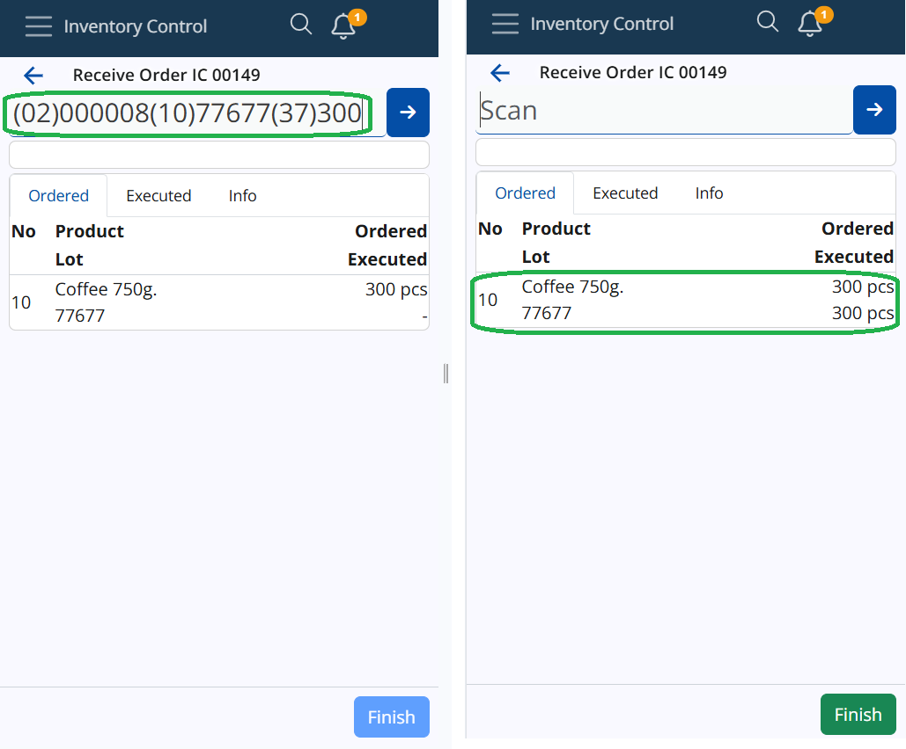
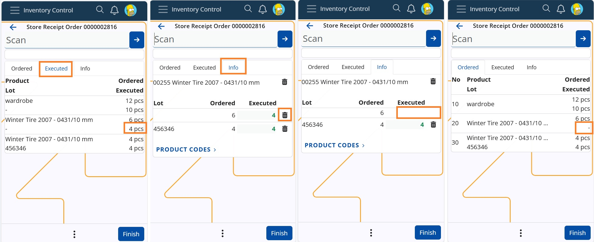

# Inventory Control

Inventory Control is a mobile inventory management application designed to speed up and simplify basic operations with store orders. It's perfectly suitable for shops and smaller stores.

It follows a similar logic to the **BarCodeCommand** panel from within the **Desktop Client**, but much simpler. It allows workers to complete their daily tasks quickly, without going through the more complex procedures of the **[WMS module](/modules/logistics/wms/wms-worker/index.md)**.

 

You can **receive**, **issue**, **reconcile**, **transfer** and **scrap** orders in just a few steps. These actions are **not** synchronized in real-time with the ERP.net system - you need to create the respective receipt transaction, issue transaction, transfer order, and reconciliation documents in order to reflect them. 

### Prerequisites

Before you start using Inventory Control, you'll be prompted to select the **store** for which you want to perform different operations.

That store will be saved for follow-up operations but can easily be switched to a different one with the help of the **Change** button.

## Common features

Here, you can observe the most commonly used features in the **Inventory Control** panel.

### Scanning

In order to scan your products manually, you need to use the **Scan** field.

It lets you quickly insert the instances of a product you want to add either manually or through barcode commands.

For a list of available barcode templates, check out the **[Command list](command-list.md)**.

### Individual scan

Simply type in a product's code once (e.g. "0000001") in order to add only one pcs of it. Tap the **blue arrow** to confirm.

Every time you scan, you'll be taken to the **Info** tab for the respective product. 

Successfully scaned pcs are painted in **green**.

If more lots are present for a product, the FEFO principle determines which lot has pcs add first.

Incorrect product codes will generate an error. 

### Multiple scans

To scan more pcs or the exact number of pcs for a product, specify it first (e.g. "50"), add a "*", and then enter the product code.

This can be done on one line (e.g. 50*1001150), or on two separate lines for each input. Tap the **blue arrow** to confirm.

> [!NOTE]
> 1. The **trash bin button** allows you to remove the latest operation, which will restore the previous operation value.
> 2. Any one, two or three-number combination is automatically counted as a **multiplier**. You can insert it without adding "*" in the end.
> 3. You can remove inserted multipliers by tapping the **Clear button (X)**.

### Zero count

If you enter a zero quantity in the **Scan** field, all of the entered quantities before will be set to **zero**.

### Select a product from the Info tab

You also have the option to enter a product's code only by tapping on its code within the **Info** tab. 

When you do that, the product code will be automatically entered in the **Scan** field.

If you need to scan **multiple** quantities of your product, you can provide a quantity into the Scan field.

Once you tap on the product's code, you can enter **all** of the quantities at once.

### Scan a GS1 

Inventory Control also supports GS1 Barcodes and recognizes a number of GS1 application identifiers.

GS1 barcodes are a type of barcode used in retail and supply chain operations to identify items. They are used in many countries and are based on the international GS1 standard. These barcodes use a list of different application identifiers (AI) to encode additional data into the barcode such as quantity, lot, expiration date, serial number, and other attributes.

Inventory Control works with some of the most popular GS1 identifiers to recognize the product and the additional information that comes with it and is also encoded into the barcode.

A list of the identifiers that are recognized:

| Identifier | Description | Length | 
| ---------- | ----------- | ------ |
| (01) | Global Trade Item Number (GTIN) | 14 |
| (02) | Global Trade Item Number (GTIN) of contained trade items | 14 |
| (10) | Lot number | variable, up to 20 |
| (21) | Serial number | variable, up to 20 |
| (37) | Count of trade items | variable, up to 8 |

Once triggered, it tries to break the GS1 barcode into separate parts to extract the information encoded in it. If there are no errors during this operation, it starts looking for an appropriate line that can be executed with the recognized information. When it finds the best matching line, it starts its execution. If the information is enough to fulfill the line, then the system will not ask the user for anything and will automatically execute the line.
If there is no matching line – it throws an error message and stops the execution.

For example, if there is a Store Order line that contains a product with Part Number 000008, a specific lot 77677, and a quantity of 300 pcs and you scan the following barcode (02)000008(10)77677(37)300, this line will be automatically fulfilled.

> [!NOTE]
> The identifier (21) Serial Number is also recognized, but for now, it's just saved in the memory of the IC application.

# **How to Use the Bin in Inventory Control**

In our Inventory Control module, the bin plays a crucial role in managing product counts. There are two types of bins used in all operations, both available in the **Info** panel:

* Delete-all Bin (Large Bin) and
* Delete-row Bin (Small Bin)

## Using the Delete-all bin 

The "large bin" is located at the top, on the product row. It is used to delete all counts and executions for a specific product, marking it as unexecuted or not counted at all. The process is similar for all operations like Receive, Issue, Scrap, Transfer, Quick reconcile and Planned reconcile.

  **Steps:**
  
Let say you execute a Receive operation of an Order consisting of three lines - products X, Y and Z. Each line has been executed as seen in tab Executed and in Executed field.
You decide to delete all executed quantities for product X:

1. Navigate to the Info tab of product X.
2. Locate the large bin at the top of the product row.
3. Click on the bin icon -> A pop-up message appears to confirm deletion.
4. Choose Delete to confirm.
   
  **Result:**
+ The quantity for product X in the Executed field is deleted
+ The row related to this product in tab Executed is removed.
+ After deletion, it appears as if the product was never executed.

 

Another example at operation **Planned Reconcile**, in which you count 50pcs of product X and 20pcs of product Y. In field Counted is entered the quantity for each product and in tab Counted are registered the rows for the counted products. You decide to delete all counts for product X. Execute the forementioned steps (1-4). As a result all counted quantity for product X is deleted as if never counted. If you check the records in panel Counts in Reconciliation document, you will see that the line is also removed from there.

 

## Using the Delete-row bin

The "small" bin is used to delete individual product count rows at all IC operations. It is helpful with products having lots or variants, allowing users to delete distributed quantities for specific lots or variants. For example, if a scanned quantity is spread across multiple lots, users can now remove the count for a chosen lot without affecting others. 

**Steps:**
  
Let say you execute a Receive operation of an Order consisting of three lines, for two products X and Y, and product Y is ordered in a lot as well. Execution of 8pcs of product Y results in distribution of the quantity between the unspecified product lot (4pcs) and the specified lot (4pcs). Now each line has been executed as seen in tab Executed and in Executed field.
You decide to delete the quantity of the unspecified lot of product Y:

1. Navigate to the Info tab of product Y;
2. Locate the small bin on the row, next to the desired qunatity ("4");
3. Click on the bin icon.
> [!WARNING]
> No confirmation message for the deletion will pop-up!

  **Result:**
+ The quantity for the unspecified lot of product Y in the Executed field is deleted.
+ The row related to this product and lot in tab Executed shows a dash "-".
+ After deletion, it appears as if the lot was never executed.
  

Another example at operation Quick Reconcile, and you count 4000pcs of product X. The amount is distributed between the available lots. You decide to delete the counted quantity of the specified lot ("00022"). Simply click on the bin in the row of the lot, next to quantity "100" and without any warning, it will be deleted. The row in tab Counted will also be deleted.

By using these bin functionalities effectively, you can ensure accurate inventory management while maintaining flexibility in operations.

### Continue last started operation

Inventory Control allows you to **resume** the last operation you were performing. 

If you exited a receive operation mid-way, for example, it will be displayed as a **shortcut** in the main menu. 

You can tap the **Continue** button to proceed with it.

If you choose to begin a new operation **before** completing the latest one, a **warning** will appear, asking you to confirm the termination of the latest operation.

> [!NOTE]
> If in the middle of the execution you decide to change Language, Company or Location from the User menu, you will be taken to the initial IC screen with no progress saved.

Learn more about Inventory Control in the following articles:

* **[Settings](settings.md)**
*	**[Receive](receive.md)**
*	**[Issue](issue.md)**
*	**[Planned Reconcile](planned-reconcile.md)**
*	**[Quick Reconcile](quick-reconcile.md)**
*	**[Transfer](transfer.md)**
*	**[Scrap](scrap.md)**
*	**[Command list](command-list.md)**

> [!NOTE]
> 
> The screenshots taken for this article are from v.24 of the platform.
