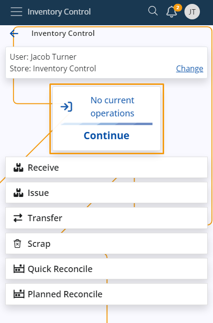

# Inventory Control

Inventory Control is a mobile inventory management application designed to speed up and simplify basic operations with store orders. It's perfectly suitable for shops and smaller stores.

It follows a similar logic to the **BarCodeCommand** panel from within the **Desktop Client** and allows workers to complete their daily tasks quickly, without going through the more complex procedures of the **[WMS module](/modules/logistics/wms/wms-worker/index.md)**. 

You can **receive**, **issue**, **reconcile**, **transfer** and **scrap** orders in just a few steps. These actions are **not** synchronized in real-time with the ERP.net system - you need to create the respective receipt transaction, issue transaction, transfer order, and reconciliation documents in order to reflect them. 

### Prerequisites

Before you start using Inventory Control, you'll be prompted to select the **store** for which you want to perform different operations.

That store will be saved for follow-up operations but can easily be switched to a different one with the help of the **Change** button.

## Common features

Here, you can observe the most commonly used features in the **Inventory Control** panel.

### Select a product from the Info tab

In **Inventory Control**, you have the option to scan a product by either manually typing its code into the **scan** field or by selecting the code within the **Info** tab. When you choose the latter option, the product code will be automatically entered in the **Scan** field.

Prior to scanning a product, you can input a number into the **Scan** field. Afterward, when you choose a product, it will be scanned the specified number of times.

### Continue last started operation

In **Inventory Control**, you have the option to resume the last operation you were performing. The most recent operation will be displayed in the main menu upon opening. tap the **Continue** button to proceed with it.

If you choose to initiate a new operation before completing the ongoing one, a warning message will appear, prompting you to confirm the termination of the current operation.

If there are no ongoing operations, the window will indicate that there are no current ones.

Learn more about Inventory Control in the following articles:

* **[Settings](settings.md)**
*	**[Receive](receive.md)**
*	**[Issue](issue.md)**
*	**[Reconcile](reconcile.md)**
*	**[Transfer](transfer.md)**
*	**[Scrap](scrap.md)**
*	**[Command list](command-list.md)**
