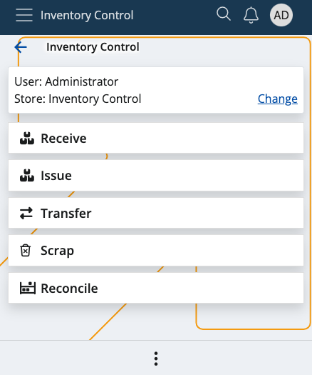
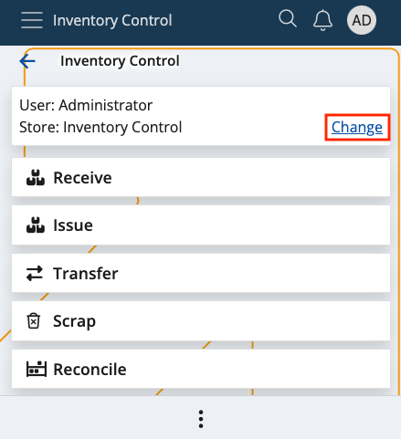

# Inventory Control

Inventory Control is a mobile inventory management application designed to speed up and simplify basic operations with store orders. It's perfectly suitable for shops and smaller stores.

It follows a similar logic to the **BarCodeCommand** panel from within the **Desktop Client** and allows workers to complete their daily tasks quickly, without going through the more complex procedures of the **[WMS module](../wms-worker/index.md)**. 

You can **receive**, **issue**, **reconcile**, **transfer** and **scrap** in just a few steps. These actions are **not** synchronized in real-time with the ERP.net system - you need to generate the respective receipt transaction, issue transaction, transfer order, and reconciliation documents in order to reflect them. 

### Prerequisites

Before you start using Inventory Control, you'll be prompted to select the **store** for which you want to perform different operations.

That store will be saved for follow-up operations but can easily be switched to a different one with the help of the **Change** button.

Learn more about Inventory Control in the following articles:

* **[Settings](settings.md)**
*	**[Receive](receive.md)**
*	**[Issue](issue.md)**
*	**[Reconcile](reconcile.md)**
*	**[Transfer](transfer.md)**
*	**[Scrap](scrap.md)**
*	**[Command list](command-list.md)**
