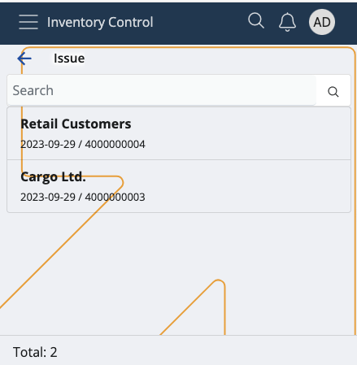
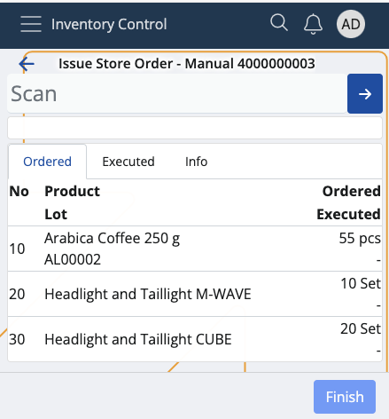

# Issue

This section allows you to **deduct** product quantities from your inventory or shop's store, and **create** issue store transactions.

Issued quantities which are successfully executed are counted out of your store's overall availability.

### Prerequisites

Make sure you've set the correct document type for this operation within the **[Settings](settings.md)**.

You'll then be prompted to select the **released order** for which you want to issue product quantities.

Available orders are filtered by **enterprise company** and **location**.

If you tap on one, you'll be taken to the **Issue** order.

## Overview

Issue is composed of three tabs:

* **Ordered**
* **Executed**
* **Info**

### Ordered

This is where all of your ordered product quantities are listed, together with their lots and product lines, if present.

### Executed

Here, you can find how many quantities of the products are **issued** as opposed to being **ordered**.

For example, out of 30 ordered pcs, only 15 may be issued. This will be reflected in the issue store transaction.

### Info

If you tap on a product from the **Ordered** tab, you'll be shown further information about it here.

This includes revealing its part number and additional codes, if present, as well as ordered/executed quantities.

If more lots are present, the **ordered-executed** ratio will be distributed based on the **FEFO** (first expire - first out) principle.

## Scanning

In order to mark product quantities of an order as deducted from your store, you need to use the **Scan** field.

It lets you quickly insert the instances of a product you want to confirm as **issued** either manually or through barcode commands.

For a list of available barcode templates, check out the **[Command list](command-list.md)**.

If you're unfamiliar with the process of scanning a product and require assistance, refer to our **[overview](index.md)**.

> [!NOTE]
> The executed pcs of a product **cannot** be more than what is ordered.

### Zero count

If the Executed bar is left with zero, this will be interpreted as the product having deducted "0 pcs". 

In the final issue store transaction, there will be no lines for the product.

## Create an issue store transaction

Once you're done scanning the desired product quantities, you can go back to the **Executed** tab to see if you've made any mistakes.

The **Ordered** value will be positioned above the **Executed** one, making it easy to compare these values.

If all ordered product quantities have been issued, the **Finish** button will be painted in green.

Tap on it once to create your issue store transaction.

This will take you to a separate space with direct link to the document type for this operation.

By tapping on it, you'll access the **Inventory** module from where you can release and complete the document.

