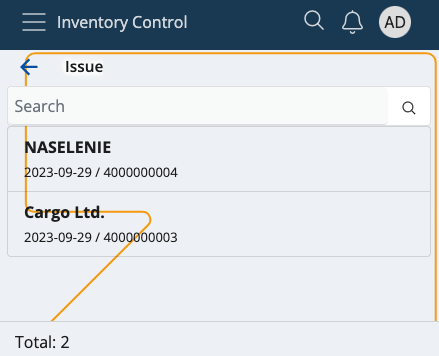

# Issue

This section allows you to **deduct** product quantities from your warehouse or shop's store, and **generate** issue store documents.

Issued quantities which are successfully executed are counted out of your store's overall availability.

### Prerequisites

Make sure you've set the correct document type for this operation within the **[Settings](settings.md)**.

You'll then be prompted to select the **released order** for which you want to issue product quantities.

Available orders are filtered by **enterprise company** and **location**.

If you tap on one, you'll be taken to the **Issue** module.

## Overview

Issue is composed of three tabs:

* **Ordered**
* **Executed**
* **Info**

### Ordered

This is where all of your ordered product quantities are listed, together with their lots and product lines, if present.

### Executed

Here, you can find how many quantities of the products are **issued** as opposed to being **ordered**.

For example, out of 30 ordered pcs, only 15 may be issued. This will be reflected in the issue store document.

### Info

If you tap on a product from the **Ordered** tab, you'll be shown further information about it here.

This includes revealing its unique ID, barcode and GTIN, if present, as well as how many instances of it will be executed.

If more lots are present, the **ordered-executed** ratio will be distributed based on the **FEFO** (first expire - first out) principle.

## Scanning

In order to execute ordered quantities, you need to use the **Scan** field.

It lets you quickly insert the instances of a product you want to confirm as issued either manually or through barcode commands.

For a list of available barcode templates, check out the **[Command list](command-list.md)**.

### Individual scan

Simply type in a product's ID once (e.g. "0000001") in order to execute only one pcs of it. Tap the **blue arrow** to confirm.

Every time you scan, you'll be taken to the **Info** tab for the respective product. Successfully executed pcs are painted in **green**.

If more lots are present for a product, the FEFO principle determines which lot has pcs executed first.

Incorrect product IDs will generate an error.

### Multiple scans

To execute more pcs or the exact number of pcs for a product, specify it first (e.g. "50"), add a "*", and then provide the product ID.

This can be done on one line (e.g. 50*1001150), or on two separate lines for each input. Tap the **blue arrow** to confirm.

**NOTE!**

1. The **trash bin button** allows you to remove the latest execution, which will restore the previous Executed value.

2. Any one, two or three-number combination is automatically counted as a **multiplier**. You can insert it without adding "*" in the end.

3. You can remove inserted multipliers by tapping the **Clear** button (X).

4. The issued pcs of a product **cannot** be more than what is ordered.

### Zero count

In case you've made a mistake and want to start the execution process from scratch, type in "0*" followed by the affected product ID.

If the **Executed** bar is left with zero, this will be interpreted as the product being issued "0 pcs" in the final issue store document.

## Generate an issue store document

Once you're done scanning the desired product quantities, you can go back to the **Executed** tab to see if you've made any mistakes.

The **Ordered** value will be positioned above the **Executed** one, making it easy to compare these values.

If all ordered product quantities have been issued, the **Finish** button will be painted in green.

Tap on it once to generate your issue store document.

This will take you to a separate space with direct access to the document template for this operation.

By tapping on it, you'll access the **Inventory** module from where you can release and complete the document.

