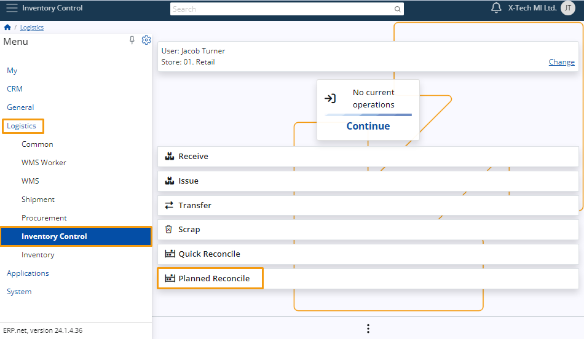

# Planned Reconciliation 

In **ERP.net**, **Planned Reconciliation** optimizes inventory management by allowing users to efficiently organize and filter inventories based on their status (Planned, Firm Planned), store location, and recent dates. 

This feature enhances visibility and control, providing comprehensive details such as **Default Product Group**, **Document Number**, and **Document Date** directly within the inventory list.

**Planned Reconciliation** is ideal for comprehensive, scheduled inventories, such as annual counts or planned audits based on product groups. 

In contrast, **Quick Reconciliation** is designed for fast, on-the-spot counts or when discrepancies are observed. 

## Navigation 

To use **Planned Reconciliation**, go to **Logistics -> Inventory Control -> Planned Reconciliation**. 

## Planned Reconciliation usage

Here are the steps required to perform a **Planned Reconciliation**.

### Create a Reconciliation document 

The reconciliation is for store reconciliations (physical counting), useful for real-world inventories, and establishing an opening balance.

#### Navigation 

Go to **Logistics -> Inventory -> Reconciliations -> Create Reconciliation**.

#### New Reconciliation 

To perform a reconciliation, you must fill in certain fields: **Default Store**, **Default Product Group**, and **Reconciliation Type**.

 

###### Reconciliation Type

There are two options for **Reconciliation Type**: **Full** and **Partial**. 

 

To proceed with a **Planned Reconciliation**, you must first select a product group. 

During the audit of this group, uncounted products will have their quantities set to zero in **Full Reconciliation**, while in **Partial Reconciliation**, their previous quantities will be retained.

[!]Note:
For a **Reconciliation** to appear in **Planned Reconciliations**, its status needs to be set to **planned**.
 
 

### View Planned Reconciliations

When you navigate to **Planned Reconciliations** in **Inventory Control**, you will see a list of all upcoming reconciliations and those from the past week with the status set to **Planned**.

 

[!]Note: 
If a reconciliation has a product group, it will be named accordingly. If not, it will be named “-”.

 

### Planned Reconciliation Execution

Clicking on a reconciliation in the list will open the **Availability** tab. 

Here, you will find all products from the assigned product group in the storage. 

 

If no product group is assigned, the entire storage availability will be shown.

 

### Scan Products

To scan products, click on them and then click the arrow button.

[!]Note:
For more information about how to scan a product, go to our article on the [subject]( https://docs.erp.net/tech/modules/logistics/wms/wms-worker/orders/scanning.html?q=scan)

 

The info panel logs all scans, showing the time of each scan. 

 

You can also delete scans from this log if necessary.

 

[!]Note:
You can see the scanned products in **Counted**.

 

[!]Note:
The platform retains information about ongoing **Planned Reconciliations** persistently, even if you navigate away from the page or close the platform entirely.

# Calculate reconciliation based on the counts

The "Calculate reconciliation based on the counts" function consolidates product quantities from the Counts panel of a reconciliation order into summarized lines in the Lines panel.

It ensures that products counted in the same store and product group are either summed up or represented with a zero quantity, depending on the reconciliation type (Partial or Full).

For more information, you can read our [article](https://docs.erp.net/tech/modules/logistics/inventory/how-to/reconciliation-based-counts.html) on the subject.

> [!NOTE]
> 
> The screenshots taken for this article are from v24 of the platform.
