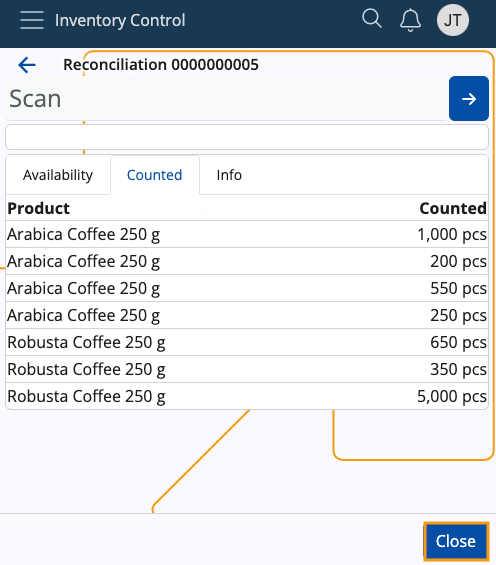
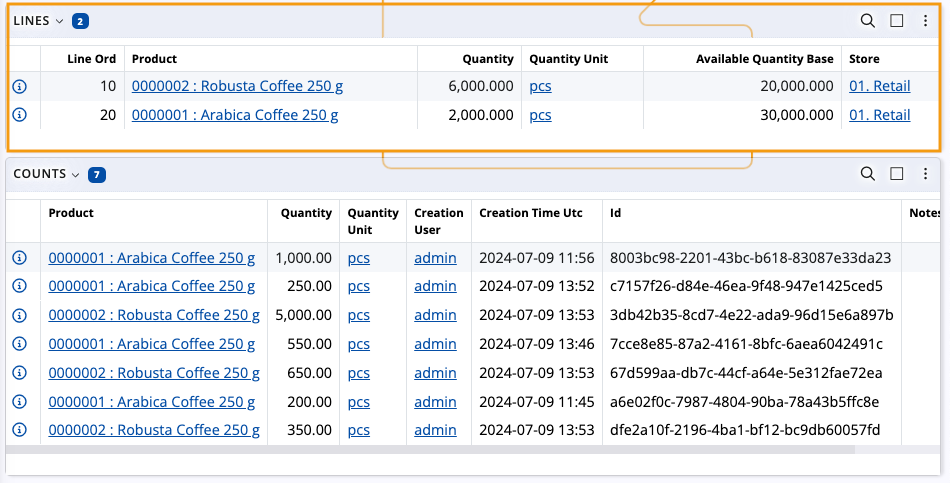

# Planned Reconcile

This section allows you to count and update product quantities available in a store based on an existing reconciliation order.

**Planned reconcile** is ideal for larger inventories where annual reconciliations or planned audits are performed for individual stores and product groups. It also makes the process more flexible by offering one of two **reconciliation types**.

In contrast, **[Quick reconcile](quick-reconcile.md)** is designed for fast, on-the-spot reconciliations, even when minor discrepancies are observed. 

## Prerequisites

Make sure you've set the correct document type for this operation within the **[Settings](settings.md)**.

You need to have at least one existing reconciliation order to use this module.

### Create an order

When creating a reconciliation order, you need to select a **Default Store** for it, and optionally choose a **Default Product Group**.

There are two **types** of reconciliation orders: **Full** and **Partial**. 

Depending on which one you choose, you can determine what happens with counted and not counted product quantities. 

* **Full** - Products that are not counted are considered missing and will get a quantity of "0" assigned.
  
* **Partial** - Products that are not counted are not reconciled and their quantity will remain the same.

 

> [!Note]
> For a reconciliation order to be recognized in **Planned Reconcile**, its state needs to **Planned** or **Firm planned**.
 
 

## Overview

When you access **Planned Reconcile**, it will load a list of existing reconciliation orders filtered by the following criteria:

* Their states are "Planned" or "Firm planned".
  
* All of them have a **Default Store** equivalent to the one selected for Inventory Control.
  
* Each document's **Date** is no older than seven days prior to the current day and/or not newer than seven days following the current day. 

Documents not matching these conditions will **not** be visualized.

 

> [!Note] 
> If a reconciliation order has a **Default Product Group** assigned, it will be named by it. If not, its name will be replaced by a dash.

---

Planned Reconcile is composed of three tabs:

* **Availability**
* **Counted**
* **Info**

### Availability

This is where all of your store products are listed, together with their currently available quantities.

If the reconciliation order has a **Default Product Group** assigned, only products belonging to that group will be shown.

 

### Counted

Here, you can find how many quantities of the products have been **counted**.

Each count operation will have its own line, and the newest one will be positioned at the top.

 

### Info

This tab includes details about the products, including additional codes, if present, as well as the total counted quantities up to this moment and the ability to **scrap** them. If you tap on a product from the **Availability** tab, you'll be shown further information about it here. 

All registered counts feature the **date and time** when they occured, and can be individually **deleted**.

 

## Scanning

In order to count quantities of products in Planned Reconcile, you need to use the **Scan** field.

It lets you quickly insert the instances of a product you want to **count** either manually or through **[barcode commands](command-list.md)**.

If you're unfamiliar with the process of scanning a product and require assistance, refer to our **[Inventory Control overview](index.md)**.

### Common features

Just like in **[Quick Reconcile](quick-reconcile.md)**, you can:

* scan product quantities **higher** than the currently available ones
  
* introduce product quantities that **haven't** been previously counted

### Zero counts

You can count **zero** quantities of products as many times as needed without changing the total counted quantity up to this moment.

This will result in **new lines** being created.

Only when "0" is the final counted number will the quantity of the product change to zero in the final reconciliation document.

 

> [!Note]
> If you leave **Planned Reconcile** in the middle of counting, your progress will be saved.   This applies even if you begin other operations within **[Inventory Control](index.md)**. 

## Parallel counting

Multiple workers can **simultaneously** count product quantities for the same reconciliation order.

Even if you have started the counting process and left it midway, another worker can join in and continue from where you left off.

The latest **Counted** value, therefore, is never lost, and counting is always done in real-time.

## Calculate reconciliation based on counts

Once you are done counting product quantities, click **Close**. This will bring you back to the main Inventory Control application.

 

Navigate to the respective reconciliation order within **Inventory**.

Inside, you can see that its **Counts** panel has reflected all counted instances of products, revealing further information about each. 

 

Using a handy **function**, you can consolidate individual quantity counts from the **Counts** panel into summarized lines in the **Lines** panel.

This ensures that products counted in the same store and belonging to the same product group are **automatically** summed up or represented by a zero quantity, depending on the selected reconciliation type (Partial or Full).

 

For more information, please refer to **[Calculate reconciliation, based on the counts](https://docs.erp.net/tech/modules/logistics/inventory/how-to/reconciliation-based-counts.html)**.

> [!NOTE]
> 
> The screenshots taken for this article are from v24 of the platform.
