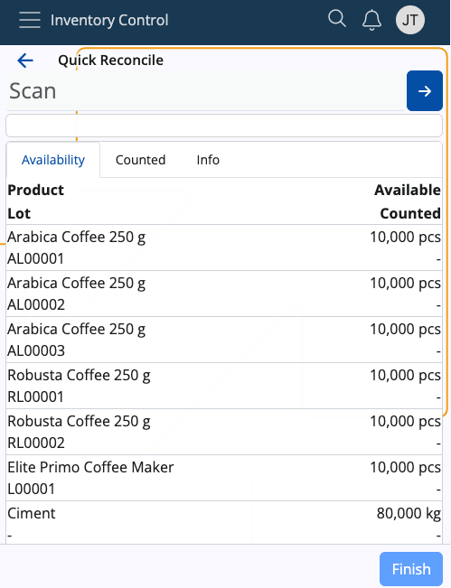
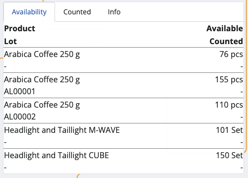
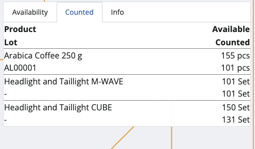
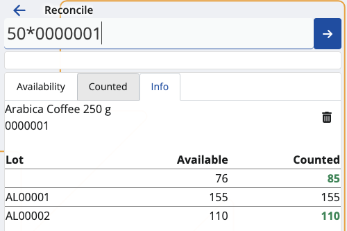
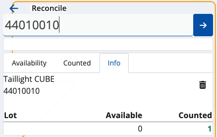
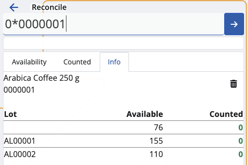
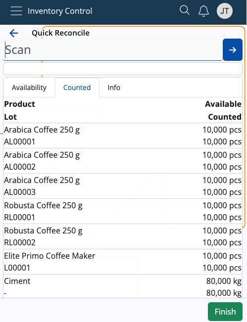
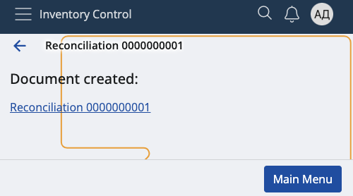
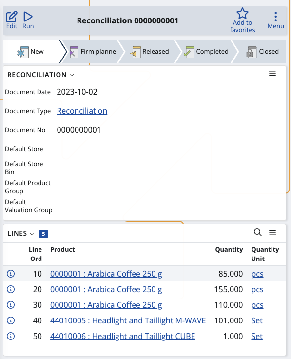

# Quick Reconcile

This section allows you to **update** the available quantities of your inventory or shop's products, and **create** reconciliation documents.

By occasionally counting everything, it may turn out that some products have fewer or higher quantities, or are no longer present.

The reverse could also be true: new products may be identified but not entered into the system.

**Inventory Control** allows you to reflect any of these changes within its **Quick Reconcile** section.

### Prerequisites

Make sure you've set the correct document type for this operation within the **[Settings](settings.md)**.

You don't need an existing order to use this module. All of your store's product quantities will be listed.

## Overview

Quick Reconcile is composed of three tabs:

* **Availability**
* **Counted**
* **Info**

### Availability

This is where all of your products are listed, together with their current quantities and lots, if present.

### Counted

Here, you can find how many quantities of the products have been **counted** as opposed to being **available** in total.

For example, out of 150pcs, only 131 may be present. This will be reflected in the reconciliation document.

### Info

If you tap on a product from the **Availability** tab, you'll be shown further information about it here. 

This includes revealing its part number and additional codes, if present, as well as counted quantities.

If more lots are present, the **available-counted** ratio will be distributed based on the FEFO principle.

## Scanning

In order to update the currently available quantities of your products, you need to use the **Scan** field.

It lets you quickly insert the instances of a product you want to **count** either manually or through **barcode commands**.

For a list of available barcode templates, check out the **[Command list](command-list.md)**.

If you're unfamiliar with the process of scanning a product and require assistance, refer to our **[overview](index.md)**.

### Higher count

The currently available pcs of a product may be **more** than what is set as available in the system.

You can update the number by providing the higher counted value, which will be reflected in the final reconciliation document.

### New count

If a product previously absent from the system is now available, you can **add** it by scanning it.

Its pcs will be reflected immediately, and once a reconciliation document is released, the **Available** bar will be updated with the new quantity.

### Zero count

You can enter a Zero quantity for the products that are missing from the store. 

Each zero count is interpreted as the product or lot having "0 pcs" in the final reconciliation document.

## Create a reconciliation document

Once you're done scanning the product quantities, you can go back to the **Counted** tab to see if you've made any mistakes.

The **Available** value will be positioned above the **Counted** one, making it easy to compare past and present values.

If the counted number is greater than or equal to the available number, the **Finish** button will be painted in green.

Tap on it once to create your reconciliation document.

This will take you to a separate space with direct link to the document type for this operation.

By tapping on it, you'll access the **Inventory** module from where you can release and complete the document.

> [!NOTE]
> The screenshots taken for this article are from v24 of the **Web Client**.
