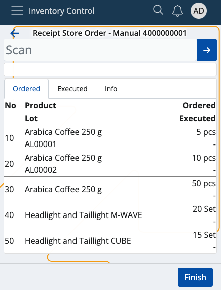
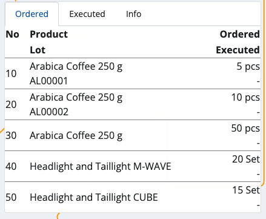
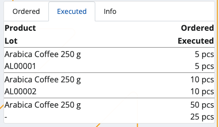
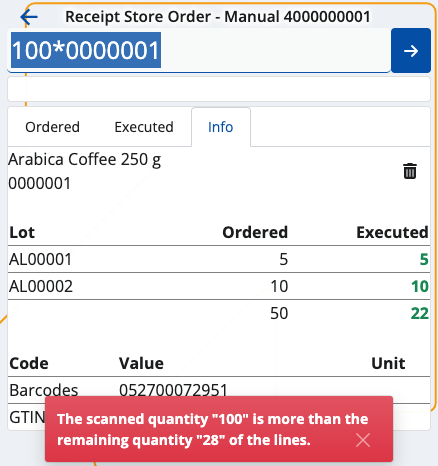
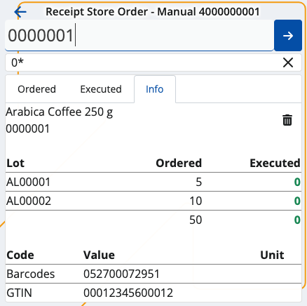
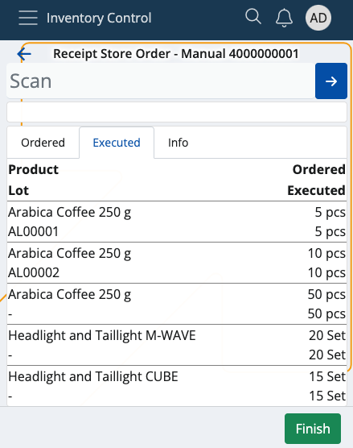
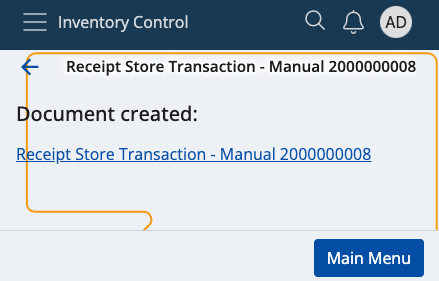
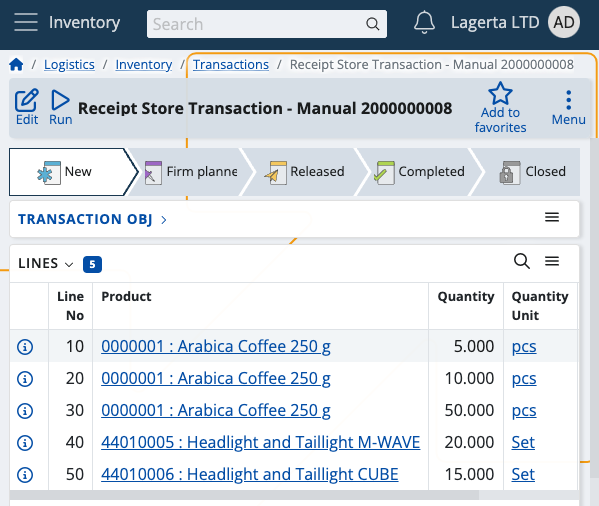

# Receive

This section allows you to **confirm** product quantities received by your inventory or shop's store, and **create** receipt store transactions.

Ordered quantities which are successfully confirmed and executed are counted towards your store's overall availability.

### Prerequisites

Make sure you've set the correct document type for this operation within the **[Settings](settings.md)**.

You'll then be prompted to select the **released order** for which you want to confirm received product quantities.

Available orders are filtered by **enterprise company** and **location**.

If you tap on one, you'll be taken to the **Receive** order.

## Overview

Receieve is composed of three tabs:

* **Ordered**
* **Executed**
* **Info**

### Ordered

This is where all of your ordered product quantities are listed, together with their lots and order lines, if present.

One and the same document can have its quantities spread across multiple lots.

### Executed

Here, you can find how many quantities of the products are **executed** as opposed to being **ordered**.

For example, out of 30 ordered pcs, only 15 may be received. This will be reflected in the receipt store transaction.

### Info

If you tap on a product from the **Ordered** tab, you'll be shown further information about it here.

This includes revealing its part number and additional codes, if present, as well as ordered/executed quantities.

If more lots are present, the **ordered-executed** ratio is distributed based on the **FEFO** (first expire - first out) principle.

For example, 250 product quantities may be distributed across 3 lots with 100, 80 and 70 each. 

The lot with quantities whose date is closest to its expiration point will be prioritised in the execution process.

## Scanning

In order to scrap currently available quantities of your products, you need to use the **Scan** field.

It lets you quickly insert the instances of a product you want to scrap either manually or through barcode commands.

For a list of available barcode templates, check out the **[Command list](command-list.md)**.

If you're unfamiliar with the process of scanning a product and require assistance, refer to our overview at **[Index](index.md)**.

> [!NOTE]
> The executed pcs of a product **cannot** be more than what is ordered.

### Zero count

You can enter a Zero quantity if it is necessary. If you enter zero quantity, all entered quantities before, will be set to zero.

If the **Executed** bar is left with zero, this will be interpreted as the product having received "0 pcs". In the final receipt store transaction, there will be no lines for the product.

## Create a receipt store transaction

Once you're done scanning the ordered product quantities, you can go back to the **Executed** tab to see if you've made any mistakes.

The **Ordered** value will be positioned above the **Executed** one, making it easy to compare these values.

If all ordered product quantities have been received, the **Finish** button will be painted in green.

**Tap** on it once to create your receipt store document.

This will take you to a separate space with direct link to the transaction for this operation.

By tapping on it, you'll access the **Inventory** module from where you can release and complete the document.

