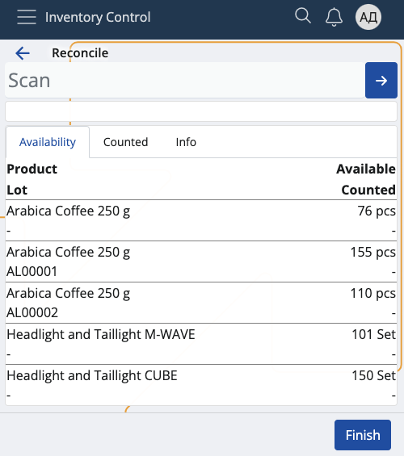
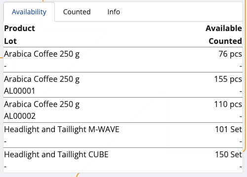
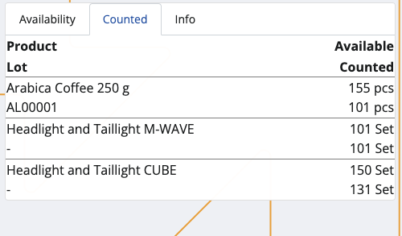
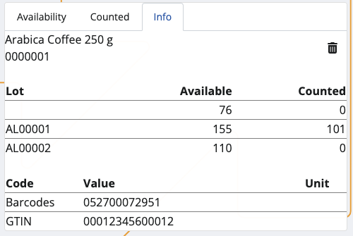
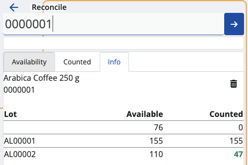
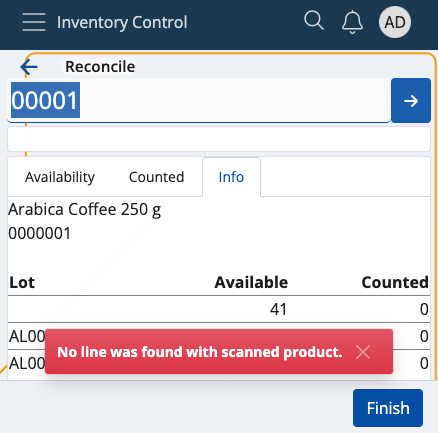
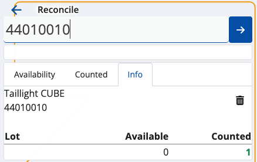
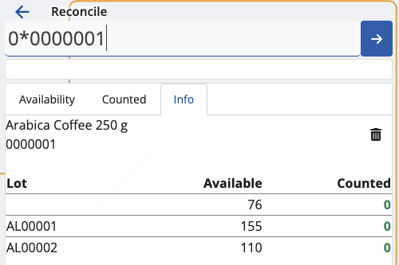
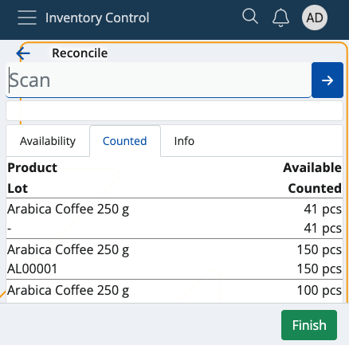
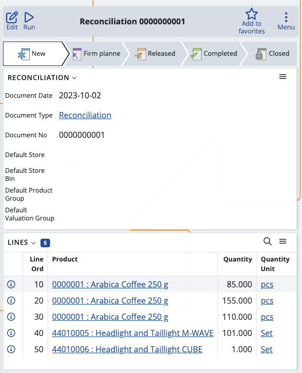

# Reconcile

This section allows you to **update** the available quantities of your warehouse or shop's products, and **generate** reconciliation documents.

By occasionally counting everything, it may turn out that some products have fewer or higher quantities, or are no longer present.

The reverse could also be true: new products may be identified but not entered into the system.

**Inventory Control** allows you to reflect any of these changes within its **Reconcile** section.

### Prerequisites

Make sure you've set the correct document type for this operation within the **[Settings](settings.md)**.

You don't need an existing order to use this module. All of your store's product quantities will be listed.

## Overview

Reconcile is composed of three tabs:

* **Availability**
* **Counted**
* **Info**

### Availability

This is where all of your products are listed, together with their current quantities and lots, if present.

### Counted

Here, you can find how many quantities of the products have been **counted** as opposed to being **available** in total.

For example, out of 150pcs, only 131 may be present. This will be reflected in the reconciliation document.

### Info

If you tap on a product from the **Availability** tab, you'll be shown further information about it here. 

This includes revealing its unique ID, barcode and GTIN, if present, as well as how many instances of it have been **counted**.

If more lots are present, the **available-counted** ratio will be distributed based on the FEFO principle.

## Scanning

In order to update the currently available quantities of your products, you need to use the **Scan** field.

It lets you quickly insert the instances of a product you want to count either manually or through **barcode commands**.

For a list of available barcode templates, check out the **[Command list](command-list.md)**.

### Individual scan

Simply type in a product's **ID** once (e.g. "0000001") in order to count only one pcs of it. Tap the **blue arrow** to confirm.

Every time you scan, you'll be taken to the **Info** tab for the respective product. Successfully counted pcs are painted in **green**.

If more lots are present for a product, the FEFO principle determines which lot has pcs counted first.

Incorrect or non-existent product IDs will generate an error.

### Multiple scans

To count more pcs or the exact number of pcs for a product, specify it first (e.g. "50"), add a "*", and then provide the product ID. 

This can be done on one line, or on two separate lines for each input. Tap the **blue arrow** to confirm.

**NOTE!**

1. The **trash bin button** allows you to remove the latest count, which will restore the previous **Counted** value.

2. Any one, two or three-number combination is automatically counted as a **multiplier**. You can insert it without adding "*" in the end.

3. You can remove inserted multipliers by tapping the **Clear button (X)**.

### Higher count

The currently available pcs of a product may be **more** than what is set as available in the system.

You can update the number by providing the higher counted value, which will be reflected in the final reconciliation document.

### New count

If a product previously absent from the system is now available, you can **add** it by scanning it.

Its pcs will be reflected immediately, and once a reconciliation document is released, the **Available** bar will be updated with the new quantity.

### Zero count

In case you've made a mistake and want to start counting from scratch, type in "0*" followed by the affected product ID.

If previously available product quantities are now non-existent, make sure to count them (or their lots) with zeroes.

Each zero count is interpreted as the product or lot having "0 pcs" in the final reconciliation document.

## Generate a reconciliation document

Once you're done scanning the product quantities, you can go back to the **Counted** tab to see if you've made any mistakes.

The **Available** value will be positioned above the **Counted** one, making it easy to compare past and present values.

If the counted number is greater than or equal to the available number, the **Finish** button will be painted in green.

Tap on it once to generate your reconciliation document.

This will take you to a separate space with direct access to the document template for this operation.

By tapping on it, you'll access the **Inventory** module from where you can release and complete the document.

