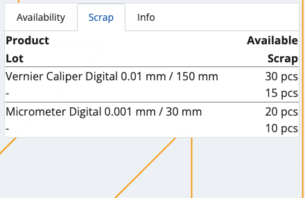
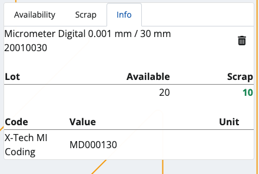
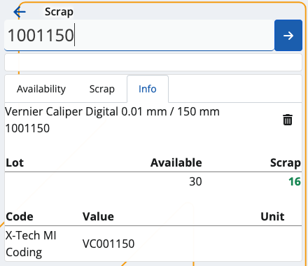
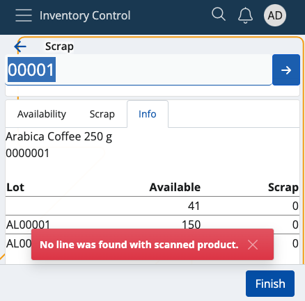
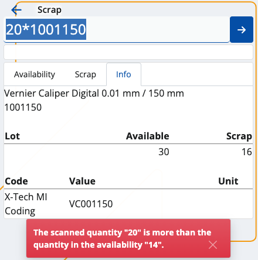
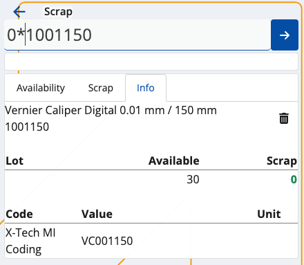
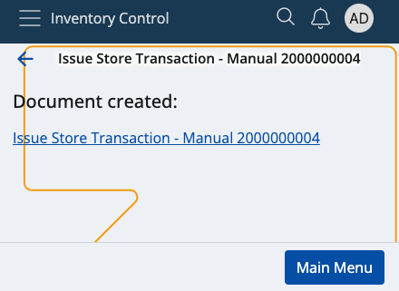
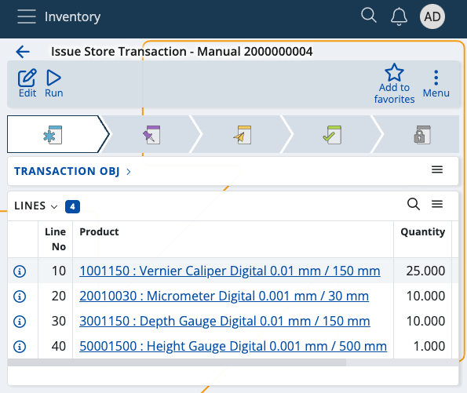

# Scrap

This section allows you to **remove** available quantities from your warehouse or shop's products, and **generate** issue store documents.

Scrapping is done when a product's expiry date is reached (respecting the FEFO rule) or the store no longer needs product quantities.

Successfully scrapped quantities are counted **out** of your store's overall availability.

### Prerequisites 

Make sure you've set the correct document type for this operation within the **[Settings](settings.md)**.

You don't need an existing order to use this module. All of your store's product quantities will be listed.

## Overview

Scrap is composed of three tabs:

* **Availability**
* **Scrap**
* **Info**

### Availability

This is where all of your store products are listed, together with their current quantities and lots, if present.

### Scrap

Here, you can find how many quantities of the products are selected for **scrap** as opposed to being **available** in total.

For example, out of 30pcs, only 15 may be scrapped. This will be reflected in the issue store document.

### Info

If you tap on a product from the **Availability** tab, you'll be shown further information about it here.

This includes revealing its unique ID, barcode and GTIN, if present, as well as how many instances of it will be scrapped.

If more lots are present, the **available-scrap** ratio will be distributed based on the FEFO principle.

## Scanning

In order to scrap currently available quantities of your products, you need to use the **Scan** field.

It lets you quickly insert the instances of a product you want to scrap either manually or through barcode commands.

For a list of available barcode templates, check out the **[Command list](command-list.md)**.

### Individual scrap

Simply type in a product's ID once (e.g. "0000001") in order to scrap only one pcs of it. Tap the **blue arrow** to confirm.

Every time you scan, you'll be taken to the **Info** tab for the respective product. Successfully scrapped pcs are painted in **green**.

If more lots are present for a product, the FEFO principle determines which lot has pcs scrapped first.

Incorrect IDs will generate an error.

### Multiple scraps

To scrap more pcs or the exact number of pcs for a product, specify it first (e.g. "50"), add a "*", and then provide the product ID.

This can be done on one line (e.g. 50*1001150), or on two separate lines for each input. Tap the **blue arrow** to confirm.

**NOTE!**

1. The **trash bin button** allows you to remove the latest scrap, which will restore the previous Scrap value.

2. Any one, two or three-number combination is automatically counted as a **multiplier**. You can insert it without adding "*" in the end.

3. You can remove inserted multipliers by tapping the **Clear button (X)**.

4. The desired pcs for scrap **cannot** be more than what is set as available in the system.

### Zero count

In case you've made a mistake and want to start the scrap process from scratch, type in "0*" followed by the affected product ID.

If the **Scrap** bar is left with zero, this will be interpreted as the product having "0 pcs" for scrap in the final issue store document.

## Generate an issue order document

Once you're done scanning the desired product quantities, you can go back to the **Scrap** tab to see if you've made any mistakes.

The **Available** value will be positioned above the **Scrap** one, making it easy to compare these values.

If all available product quantities are set to be scrapped, the **Finish** button will be painted in green.

Tap on it once to generate your issue store document.

This will take you to a separate space with direct access to the document template for this operation.

By tapping on it, you'll access the **Inventory** module from where you can release and complete the document.

