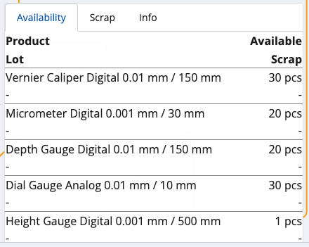

# Scrap

This section allows you to **remove** available quantities from your inventory or shop's products, and **create** issue store transactions.

Scrapping is done when a product's expiry date is reached or the store no longer needs product quantities.

Successfully scrapped quantities are counted **out** of your store's overall availability.

### Prerequisites 

Make sure you've set the correct document type for this operation within the **[Settings](settings.md)**.

You don't need an existing order to use this module. All of your store's product quantities will be listed.

## Overview

Scrap is composed of three tabs:

* **Availability**
* **Scrap**
* **Info**

### Availability

This is where all of your store products are listed, together with their current quantities and lots, if present.

### Scrap

Here, you can find how many quantities of the products are selected for **scrap** as opposed to being **available** in total.

For example, out of 30pcs, only 15 may be scrapped. This will be reflected in the issue store transaction.

### Info

If you tap on a product from the Availability tab, you'll be shown further information about it here.

This includes revealing its part number and additional codes, if present, as well as counted quantities.

If more lots are present, the **available-scrap** ratio will be distributed based on the FEFO principle.

## Scanning

In order to scrap currently available quantities of your products, you need to use the **Scan** field.

It lets you quickly insert the instances of a product you want to scrap either manually or through barcode commands.

For a list of available barcode templates, check out the **[Command list](command-list.md)**.

If you're unfamiliar with the process of scanning a product and require assistance, refer to our overview at **[Index](index.md)**.

> [!NOTE]
> The executed pcs of a product **cannot** be more than what is ordered.

### Zero count

If the **Scrap** bar is left with zero, this will be interpreted as the product having deducted "0 pcs". 
In the final issue store transaction, there will be no lines for the product.

## Create an issue order transaction

Once you're done scanning the desired product quantities, you can go back to the **Scrap** tab to see if you've made any mistakes.

The **Available** value will be positioned above the **Scrap** one, making it easy to compare these values.

If all available product quantities are set to be scrapped, the **Finish** button will be painted in green.

Tap on it once to create your issue store transaction.

This will take you to a separate space with direct access to the document type for this operation.

By tapping on it, you'll access the **Inventory** module from where you can release and complete the document.

