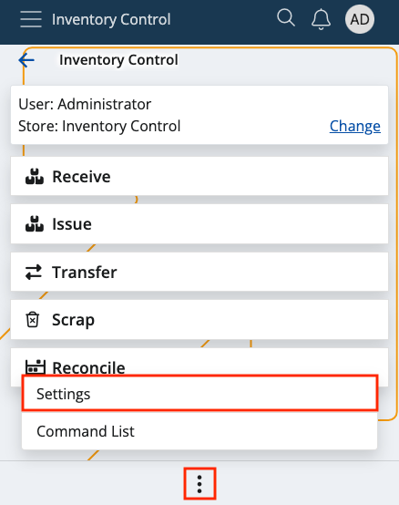

# Settings

This section lets you decide what type of **document** will be created following each of these actions:

* **Receive**
* **Issue**
* **Transfer**
* **Scrap**
* **Reconcile**

It's crucial to link the right type to its respective action **before** beginning to do anything within Inventory Control.

> [!IMPORTANT]
> For the Receive and Issue functions, under certain conditions, the **Document Type** specified in the **[Document Routes](../how-to/document-type-routes.md)** of the respective order will also be taken into account when a transaction is created.

### Navigation

In order to access the Inventory Control Settings, tap on the context menu at the bottom of the screen and select **Settings**.

### Configuration

If you tap on the **downward arrows** of any of the available options, you'll be taken to a list of your existing document types.

It's possible to link any type to either the receive, issue, scrap, transfer or reconcile operation. 

One and the same document type can be used for **multiple** operations.

