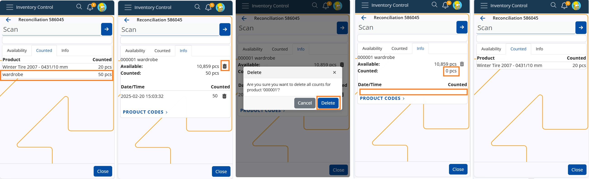
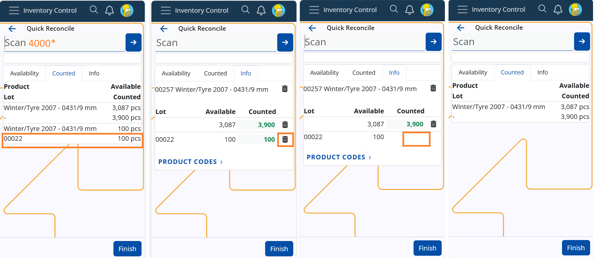

# **How to Use the Bin in Inventory Control**

In our Inventory Control module, the bin plays a crucial role in managing product counts. There are two types of bins used in all operations, both accessible in the **info** panel:

* Delete-all Bin (Large Bin) and
* Delete-row Bin (Small Bin)

## Using the Delete-all bin 

The "large bin" is located at the top, on the product row. It is used to delete all counts and executions for a specific product, marking it as unexecuted or not counted at all. The process is similar for all operations like Receive, Issue, Scrap, Transfer, Quick reconcile and Planned reconcile.

  **Steps:**
  
Let say you execute a Receive operation of an Order consisting of three lines - products X, Y and Z. Each line has been executed as seen in tab Executed and in Executed field.
You decide to delete all executed quantities for product X:

1. Navigate to the Info tab of product X.
2. Locate the large bin at the top of the product row.
3. Click on the bin icon -> A pop-up message appears to confirm deletion.
4. Choose Delete to confirm.
   
  **Result:**
+ The quantity for product X in the Executed field is deleted
+ The row related to this product in tab Executed is removed.
+ After deletion, it appears as if the product was never executed.

 

Another example at operation **Planned Reconcile**, in which you count 50pcs of product X and 20pcs of product Y. In field Counted is entered the quantity for each product and in tab Counted are registered the rows for the counted products. You decide to delete all counts for product X. Execute the forementioned steps (1-4). As a result all counted quantity for product X is deleted as if never counted. If you check the records in panel Counts in Reconciliation document, you will see that the line is also removed from there.

 

## Using the Delete-row bin

The "small" bin is used to delete individual product count rows at all IC operations. It is helpful with products having lots or variants, allowing users to delete distributed quantities for specific lots or variants. For example, if a scanned quantity is spread across multiple lots, users can now remove the count for a chosen lot without affecting others. 

**Steps:**
  
Let say you execute a Receive operation of an Order consisting of three lines, for two products X and Y, and product Y is ordered in a lot as well. Execution of 8pcs of product Y results in distribution of the quantity between the unspecified product lot (4pcs) and the specified lot (4pcs). Now each line has been executed as seen in tab Executed and in Executed field.
You decide to delete the quantity of the unspecified lot of product Y:

1. Navigate to the Info tab of product Y;
2. Locate the small bin on the row, next to the desired qunatity ("4");
3. Click on the bin icon.
> [!WARNING]
> No confirmation message for the deletion will pop-up!

  **Result:**
+ The quantity for the unspecified lot of product Y in the Executed field is deleted.
+ The row related to this product in tab Executed is removed.
+ After deletion, it appears as if the lot was never executed.
  

Another example at operation Quick Reconcile, and you count 4000pcs of product X. The amount is distributed between the available lots. You decide to delete the counted quantity of the specified lot ("00022"). Simply click on the bin in the row of the lot, next to quantity "100" and without any warning, it will be deleted. The row in tab Counted will also be deleted.

By using these bin functionalities effectively, you can ensure accurate inventory management while maintaining flexibility in operations.

