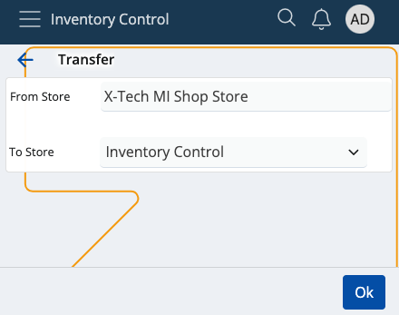
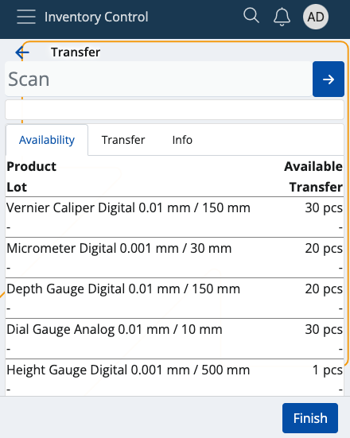
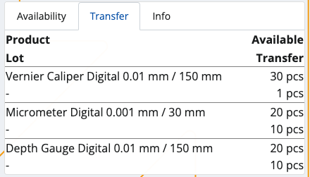
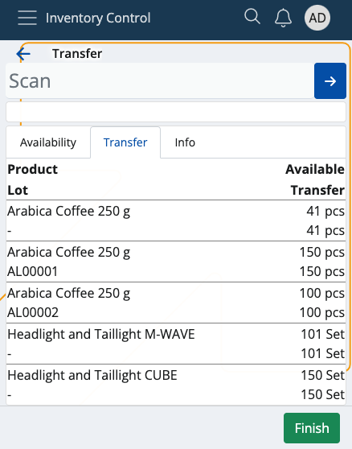
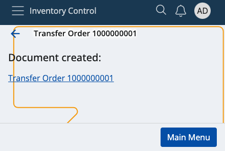
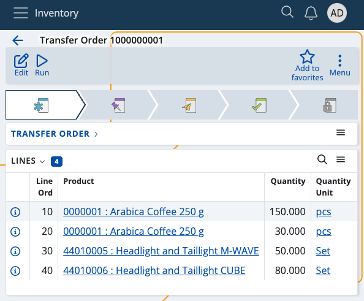

# Transfer

This section allows you to **transfer** available product quantities from one of your stores to another, and generate transfer orders.

Transfer is useful when a store needs certain quantities available in another store.

Upon every transfer, the sending store must generate a separate **issue store transaction** to reflect the transferred quantities, while the recipient store must generate a **receipt store transaction**. Both documents can be generated through **Inventory Control** or similar modules.

### Prerequisites

Make sure you've set the correct document type for this operation within the **[Settings](settings.md)**.

You'll then be prompted to select the correct store **from** which you want to transfer, and the store **to** which you want to transfer.

When done, tap **Ok**. You'll be taken to the **Transfer** module.

## Overview

Transfer is composed of three tabs:

* **Availability**
* **Transfer**
* **Info**

### Availability

This is where all of your store products are listed, together with their current quantities and lots, if present.

### Transfer

Here, you can find how many quantities of the products are selected for **transfer** as opposed to being **available** in total.

For example, out of 20pcs, only 10 may need to be transferred. This will be reflected in the transfer order.

### Info

If you tap on a product from the **Availability** tab, you'll be shown further information about it here.

This includes revealing its unique code, barcode and GTIN, if present, as well as how many instances of it will be transferred.

If more lots are present, the **available-transfer** ratio will be distributed based on the FEFO principle.

## Scanning

In order to scrap currently available quantities of your products, you need to use the **Scan** field.

It lets you quickly insert the instances of a product you want to scrap either manually or through barcode commands.

For a list of available barcode templates, check out the **[Command list](command-list.md)**.

If you're unfamiliar with the process of scanning a product and require assistance, refer to our overview at **[Index](index.md)**.

> [!NOTE]
> The executed pcs of a product **cannot** be more than what is ordered.

### Zero count

In case you've made a mistake and want to start the transfer process from scratch, type in "0*" followed by the affected product code.

If the **Transfer** bar is left with zero, this will be interpreted as the product having "0 pcs" for transfer in the final transfer order.

## Generate a transfer order

Once you're done scanning the desired product quantities, you can go back to the **Transfer** tab to see if you've made any mistakes.

The **Available** value will be positioned above the **Transfer** one, making it easy to compare these values.

If all available product quantities are transferred, the **Finish** button will be painted in green.

Tap on it once to generate your transfer order.

This will take you to a separate space with direct access to the document type for this operation.

By tapping on it, you'll access the **Inventory** module from where you can release and complete the order.

