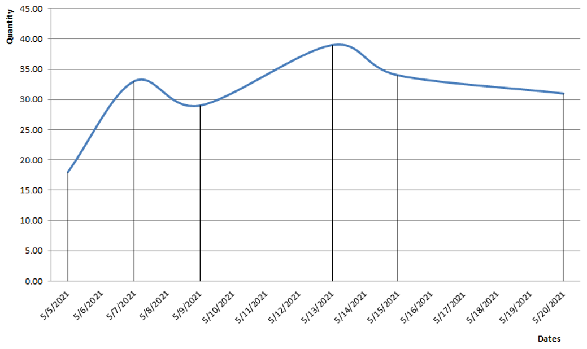

# Projected available balance

## Description

Projected available balance (PAB) shows the inventory balance projected into the future. It is the running sum of the current stock holds with scheduled receipts added, minus planned issue stock orders.

The projected available balance is used in the calculation of the [available to promise](https://docs.erp.net/tech/modules/logistics/planning/available-to-promise/index.html?q=available%20to%20promise).

## The algorithm

In the projected available balance, two kinds of data are used:

- <b>Current stock holds</b> - this is the quantity available placed in store today;

- <b>Chronology of the store orders which are not executed</b> - includes all store orders (or their unfilled parts) which are not completed yet.
  
> Note that if there are expected <i>store receipts</i> or <i>issues</i> for a past date which are still not executed, the algorithm assumes that they are being executed <b>today</b>.
  
For example:
  
- Let's assume that today <b>(2021/05/05)</b> we have <b>10 pcs</b> from <b>product A</b> in <b>store S</b>;
  
- There is an expected delivery from 3 days ago <b>(2021/05/02)</b> for <b>8 pcs</b>, which has not been executed yet;
  
- We have the following planned store movements:
  
- on <b>2021/05/07</b>, planned receipt of <b>15 pcs</b>;
  
- on <b>2021/05/09</b>, planned issue of<b> 4 pcs</b>;
  
- on <b>2021/05/13</b>, planned receipt of <b>10 pcs</b>;
  
- on <b>2021/05/15</b>, planned issue of <b>7 pcs</b>;
  
- on <b>2021/05/15</b>, planned receipt of <b>2 pcs</b>;
  
- on <b>2021/05/20</b>, planned issue of <b>3 pcs</b>;
  
With this data provided, we can calculate the following PAB:
 
|Date|Start quantity|Issue quantity|Receipt quantity|PAB
|:-:|:-:|:-:|:-:|:-:
|2021/05/05|10|-|8|18                  
|2021/05/07|-|-|15|33
|2021/05/09|-|4|-|29
|2021/05/13|-|-|10|39
|2021/05/15|-|7|2|34
|2021/05/20|-|3|-|31
 
The PAB line can be seen on the following chart:

 
> All documents in @@name that may lead to store movements can be set to generate <i>planned or firmed store orders</i> - directly or through other documents. 
> 
> With this setting, the documents can be involved in the projected available balance and [available to promise](https://docs.erp.net/tech/modules/logistics/planning/available-to-promise/index.html?q=available%20to%20promise) calculations.
