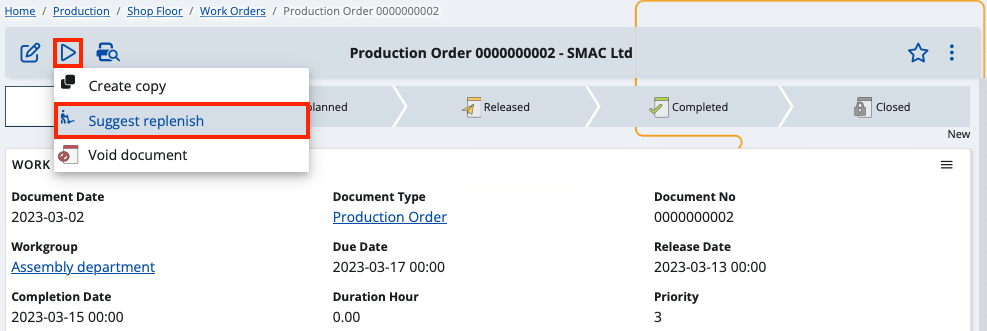

# Replenishing suggestions for work orders

If your store is running low on product quantities, you can take advantage of **replenishing suggestions** to restore the supply to a desired number.

By following the steps below, while issuing **work orders**, you'll be able to generate lines exclusively for replenishing product quantities.

## Prerequisites

For the feature to work as expected, you need to have done two things in advance:

1.	Define a **product supply** suited for work orders.

Go to **General** **->** **Products** and select **Product Supply**. From there, add a new supply with the **plus** button.

 
Make sure to go through each field carefully. 

Suggested replenishment requires specific values for certain fields in order to work.

- **Product** - The product for which the supply (and a work order) will be made.
- **Procurement Type** - The type of action associated with this product (in this case, produced products imply **Make**).
- **Generate Document Type** - The type of document which will be issued according to the supply rules (leave this as **Production Order**).
- **Store** - The store for which this product supply (and replenishment) will be made.
- **Order Point Quantity Base** - Quantity the product must drop to for replenishment to be triggered.
- **Planning Maximum Inventory Quantity Base** - Maximum possible quantity of product in the store.
- **Planning Lead Time Days** - Days needed to supply or manufacture the product.
- **Order Minimum** - Minimum quantity of product that can be ordered at a time.
- **Order Maximum** - Maximum quantity of product that can be ordered at a time.
- **Order Multiple** - Tick this box to make the produced product quantity multiple by lot size.
- **Order Lot Size Quantity Base** - The lot size value.
- **Order Policy** - The policy the replenishment system will follow (leave this as **OPS - Order Point System**). 
- **Manufacturing Policy** - The manufcaturing product policy used by the replenishment system (must be **MTS - Make-To-Stock**).
- **From Store** - Used when the procurement type is **Transfer**. 
- **Preferred Supplier** - Name of the supplier who must have produced the product (will be identical in the work order).
- **Enterprise Company** - Name of the enterprise company associated with the product supply (identical in the work order).

When done, **save** the product supply.
 
2.	Create a new work order from the **Production** **->** **Shop Floor** module. 

The status of the document should be **below** Released - most often **New**.

Make sure the product, output store and materials store and are identical to the ones you defined for the product supply. 

 
## Use Suggest replenish

You can apply the **Suggest replenish** feature from within your existing work order document. 

Click the play button and select **Suggest replenish**.

If the order has lines, they will be **removed** and new ones will be automatically generated for suggested product quantity replenishing.

