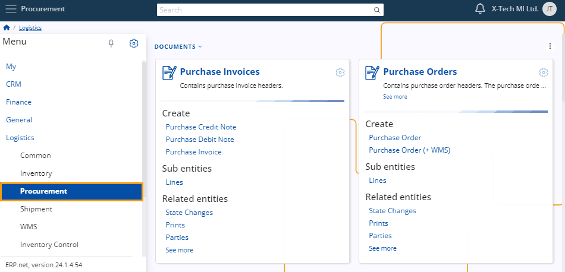
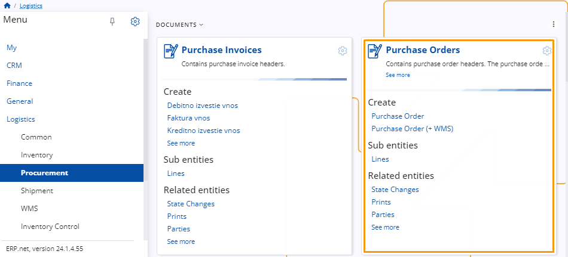
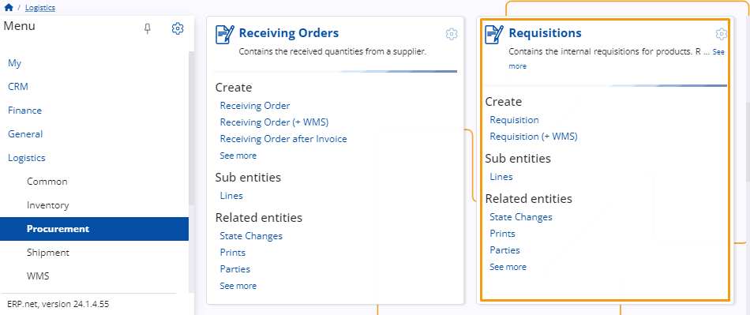

# Procurement

**The Procurement** module is used to monitor the sourcing of materials within the warehouse.

 
## Definitions 

### Suppliers  

On the **Procurement** module, it's necessary to establish one or more Suppliers. These **Suppliers** are responsible for providing products to the warehouse.

  
## Documents 

### Purchase Invoice 

To initiate a purchase request, use the **Purchase Invoice**. Within this document, specify the desired delivery warehouse and select the supplier responsible for fulfilling the order. Depending on the chosen supplier, additional options such as credit limits and delivery times may be available. 

 
### Purchase Order 

**Purchase Orders** are documents sent to suppliers to notify them of an order for goods or services. They serve as official authorization for warehouse workers to accept approved purchases.

 
### Requisitions 

This section contains internal requisitions for products, which are then aggregated by the purchase department to create **Purchase Orders**.

 
- **[Automatic lot creation](https://docs.erp.net/tech/modules/logistics/procurement/automatic-lot-creation.html?q=Automatic%20lot%20creation)**

- **[Setting cost when purchasing goods](https://docs.erp.net/tech/modules/logistics/procurement/setting-cost-when-purchasing-goods.html?q=Setting%20cost%20when%20purchasing%20goods)**

> [!NOTE]
> 
> The screenshots taken for this article are from v24 of the platform.
