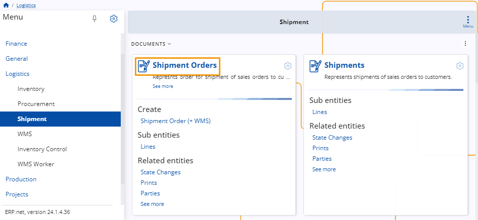
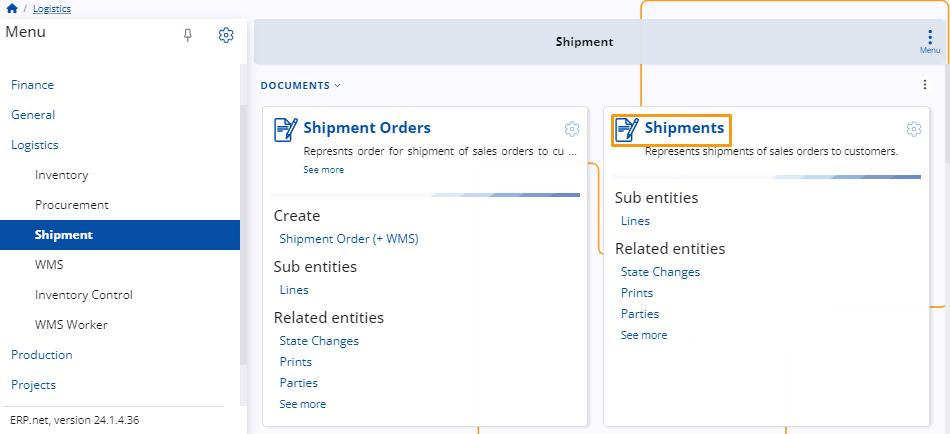

# Shipment 

The Shipment module is designed to assist in managing the shipping process for purchased stock. 

Upon purchasing stock, a Store Order is generated, followed by a Store Transaction. 

Subsequently, a Shipment Order is created based on the Store Order, facilitating the shipment of the stock.

 
## Documents 

### Shipment Order

This represents the order for shipping sales orders to customers.

 
### Shipments

Represents shipments of sales orders to customers.

 

> [!NOTE]
> 
> The screenshots taken for this article are from v24 of the platform.
