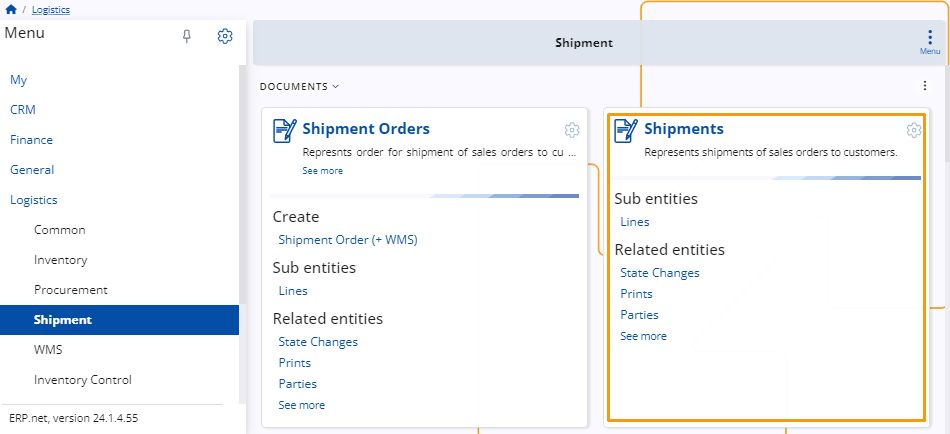

# Shipment 

The **Shipment** section is designed to assist in managing the shipping process for purchased stock. 

Upon purchasing stock, a **store order** is generated, followed by a **store transaction**. 

Subsequently, a **shipment order** is created based on the **store order**, facilitating the shipment of the stock.

 
## Documents 

### Shipment Order

This represents the order for shipping sales orders to customers.

 
### Shipments

Represents shipments of sales orders to customers.

 

> [!NOTE]
> 
> The screenshots taken for this article are from v24 of the platform.
