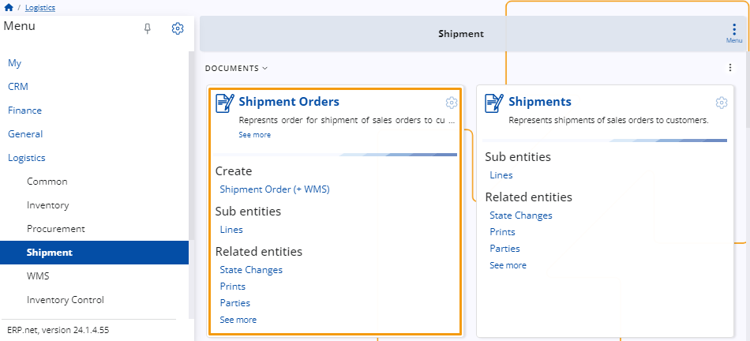

# Shipment 

This submodule is designed to assist the process of **shipping** products to different customers.

 
## Documents 

### Shipment Order

This panel allows for the creation of shipment orders.

When certain products from your warehouse are sold or leave it through any other means, you will need to create an **issue order**, including a respective issue store transaction. 

These documents are then taken by the **Shipment** submodule and lead to the creation of a **shipment order**, confirming that a certain number of products have left the store. 

 
### Shipments

Once you have created a shipment order based on an existing issue store order and transaction, you also need to create an additional **shipment document**, which includes a recipient party, delivery date and from which store the products are set to leave.

> [!NOTE]
> 
> The screenshots taken for this article are from v24 of the platform.
