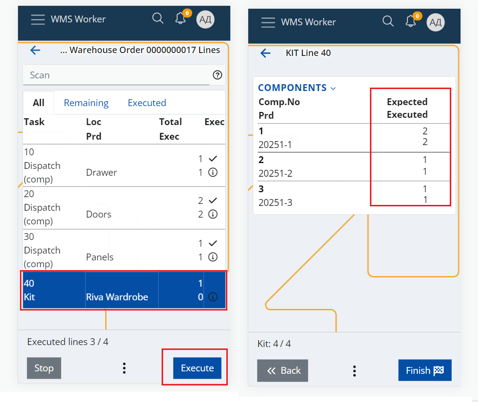

# Levels of control for composite products

It is very important to minimize errors when working with composite products. 
For example, it is crucial that the workers will not miss to dispatch some of the components or will not dispatch an additional component by mistake. This would make the customer, the management, or both unhappy and leads to additional costs for the company.

WMS introduces several levels of control which can be set for proper and controlled task execution when working with composite products. 
The control levels are set up using the "Kitting Controlling Level" and "Dekitting Controlling Level" warehouse policies where you can specify the desired level.

If no policy is specified or applicable for the particular line, then the default level is 0.

The control is performed during the order execution in the WMS Worker App (link) and more specifically during the execution of the Kit/Dekit lines of the component product. It could be fully automated or might be performed by a person in accordance with the needs of the company and it depends on the specified level of control.

## Levels
* **Level 0 - Check All**

Requires all products to be scanned again.

When executing the Kit/Dekit line, the app shows a screen, where the worker must scan all components of the kit. The component products and product quantities must exactly match those in the composite product's definition, otherwise the system will not activate the Finish button and the line could not be fulfilled.

* **Level 1 - Allow incomplete finish**

Same as level 0, but the application provides an option to still fulfill the order even when they do not match. The option is available trough the "Finish incomplete" button, situated in the button menu.

* **Level 2 - Just preview totals**

The app displays a screen with summarized information for the components of the product from its definition and the executed quantities for the selected order. The information available for counting or checking, but does not require rescanning of the components. The worker certifies that he has completed the check by pressing the Finish button.

* **Level 3 - Check and complete**

The system checks if the whole order execution exactly matches the composite product's definition when a kit/dekit execution is attempted.

If everything mathes – the kit/dekit is successfully executed.

If there are differences and the validation is unsuccessful, the app shows an error.

* **Level 4 - Autocomplete**

The system automatically executes the kit/dekit operation if all component lines are fulfilled and exactly match the composite product's definition. 
If the match validation is successful the auto execution simply wont’t work. 

> **_NOTE:_** Regardless of the level, if the worker tries to avoid the control and tries to execute/finish a kit/dekit line when there is a difference between the actual executed quantity of the components and their definition – it won’t be allowed by the system. It will show an error screen containing more details about where the problem is.
The only exception of this rule is the “Finish incomplete” button of level 1.
