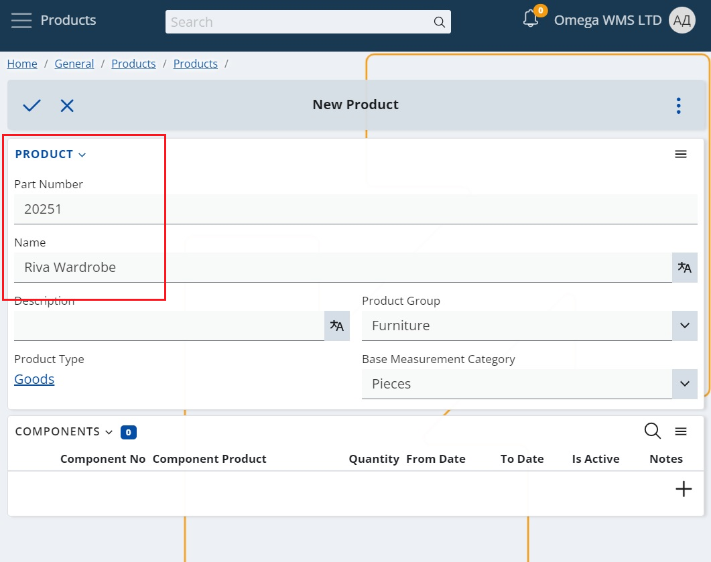
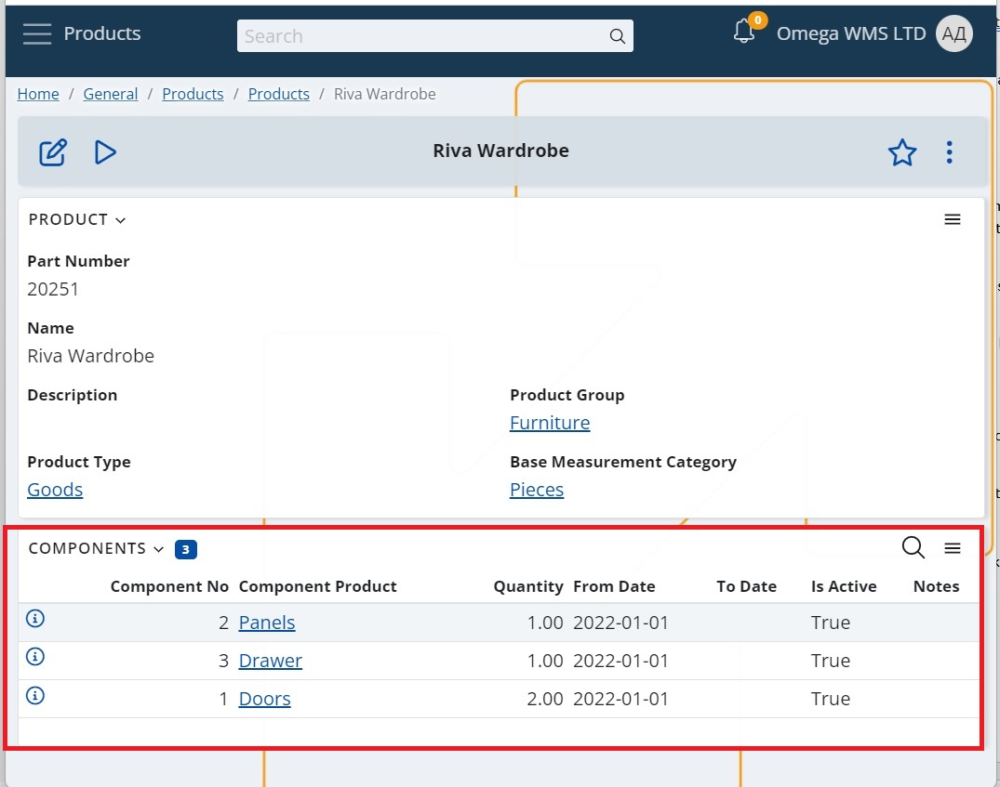

# Composite Products

Composite products are products composed of individual parts or components that may be stored and manipulated separately from one another. Since these components comprise the final distributed and sold product, their full set is treated as a single product and must be managed accordingly.

This is very common in the furniture industry, where a single wardrobe can be stored in 3 separate boxes (components). In these cases:
-	we are selling the final product (the wardrobe)
-	the availability in the inventory module is also by final product (the wardrobe). Because the sales persons need to know how many wardrobes are available in order to know how much they can sell
-	but the availability in the WMS module is by components – because in fact, the warehouse workers have to pick and dispatch all of the wardrobe components to the client

## The difference between ordinary Products, Composite Products, and Composite Product Components 
- Ordinary Products - are sold and stored in their entirety. They are not stored in separate parts and accordingly, there are no defined Composite Product Components for them.
- Composite Products - are products that are sold in their entirety, but are stored as separate components (packages). 
- Composite Product Components - are the separate parts (packages) in which the Composite Product is stored.

## How to create Composite Products?
**Composite Products** are ordinary products that have defined components for them. In other words, when there is at least one active Composite Product Component that is defined for an ordinary product, then this Product is considered a Composite Product. 

> **_NOTE:_** Only products which are not using Variable Measurement Ratios can be defined as composite products.

**Component Product Components** are ordinary products as well. They become components once they are set as a Composite Product Component for another product. 

It is not necessary each individual part to be defined as a separate component. Components are rather the packages of parts that are necessary to assemble 1 unit of the final product. For example - wardrobe doors, their handles and screws should be defined as 1 component if they are packed in the same (1) carton box.

How do you create a Composite Product then – here is an **example:**
1. Create a new Product.
 This will be your composite product, which you are going to be selling to the customers.

2. Create a new Product for all of the composite product‘s components / packages.

3. Add the Products created in step 2 in the Components panel of the Product created in step 1. 
 Make sure that you specify the Quantity, as this is the number of packages of this component that are needed to compose the product.

## Further reading
[Working with Composite Products](working-with-composite-products.md)
 [Levels of control for Composite Products](control-levels.md)
