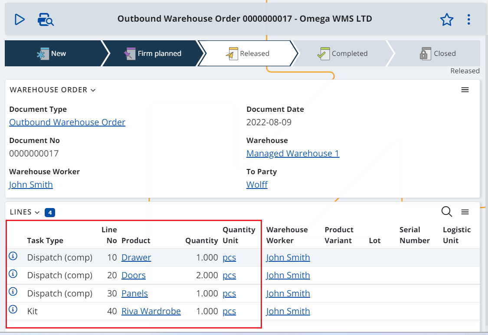

# Working with Composite Products
@composite-products are usually sold and purchased in its entirety but are stored as separate components (boxes) in the warehouse.

## Selling a composite product
We already set up our composite product definition, following the steps in the [How to create Composite Products](index.md#how-to-create-composite-products) section.

Now, lets imagine that we have a customer who wants to buy it, to buy a wardrobe.
1.	We are creating a Sales Order for 1 wardrobe.

2.	The Sales Order document flow generates a Store Order, which is the link to the WMS module. It generates a Outbound Warehouse Requisition that informs the WMS module that it needs to dispatch 1 wardrobe.

3. The Warehouse Requisition creates an Outbound Warehouse Order but the WMS, and more precisely the [LOG0502](https://github.com/ErpNetDocs/model/blob/master/generations/LOG0502.md) generation procedure, recognizes that the product is in fact a composite product. 

For this reason, the requisition line is broken down into two types of lines:
-	Dispatch (comp) – a component dispatch line for each one of the composite product’s components
-	Kit – and a kit line for the composite product itself

4. These lines are then executed by the warehouse workers using WMS Worker app.
- Dispatch (comp) lines are executed as usual for dispatch operations. 
- Kit line is executed after the Dispatch (comp) lines. It is used for fulfilling the parent (requisition) line and performing a control. 
How the control is performed depends on the specified level of control. For more information, see @levels .

5. Once the Warehouse Order has been finished the execution information is returned to the Inventory module (the Store Order). Then the Inventory module creates a Store Transaction for the dispatch composite product and the flow continues as normal (as it would for an ordinary product).

## Purchasing a composite product
The principles for purchasing a composite product are very similar to the principles for buying one.

1. We are creating a procurement document for 1 wardrobe. This document could be a Requisition, Purchase Order or Receiving Order depending on the company's usual process.

2. The procurement document flow generates a Store Order, which is the link to the WMS module. It generates a Inbound Warehouse Requisition that informs the WMS module that it needs to receive 1 wardrobe.

3. The Warehouse Requisition creates an Inbound Warehouse Order but the WMS, and more precisely the [LOG0502](https://github.com/ErpNetDocs/model/blob/master/generations/LOG0502.md) generation procedure, recognizes that the product is in fact a composite product (LOG0502).  

4. For this reason, the requisition line is broken down into two types of lines:
-	Receive (comp) – a component receive line for each one of the composite product’s components
-	Dekit – and a dekit line for the composite product itself

4. These lines are then executed by the warehouse workers using WMS Worker app.
- Receive (comp) lines are executed as usual for receive operations. 
- Dekit line can be placed before or after the Receive (comp) lines. It is used for fulfilling the parent (requisition) line and performing a control. The position of the Dekit line and how the control is performed depends on the specified level of control. For more information, see @levels .

