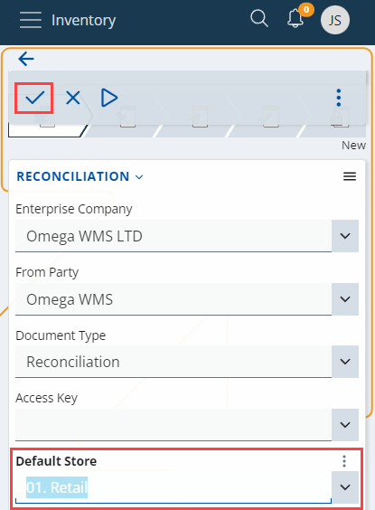
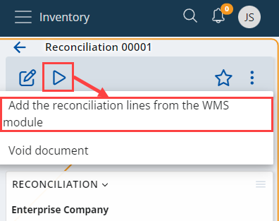
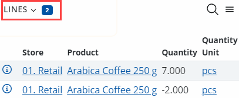

# Add reconciliation lines from the WMS module

Knowing the exact number of products in a given warehouse location is crucial for keeping order. However, there are often differences between the expected and the actual quantity of a product, which gets caught during reconciliation.   In such cases, you need to add **reconciliation lines** to the main reconciliation document. 

> [!NOTE] 
> 
> Warehouse locations are reconciled to determine how many products are being stored there. In addition, the difference between expected and actual quantity is calculated as well.

## Adding reconciliation lines

Once differences in product quantity are found, they need to be accounted. For that purpose, you need to use the _WMS module_.

To begin, create a new reconciliation document from the **Logistics --> Inventory** section.

 
Fill it with the necessary information, including the **Default Store** in which the reconciliation is done, and save the document.

To add reconciliation lines from the WMS module to an existing document, click the **play** **button** at the upper-left corner of the screen and then select the **Add the reconciliation lines from the WMS module** option. This will check exactly which calculations haven’t been accounted yet, and will load lines for manual accounting.

Define the **period** on which you want the data to be based (in days), and click **OK**.

 
In the _Lines_ section, unaccounted lines with differences in product quantity that occurred during reconciliation will be listed. 

