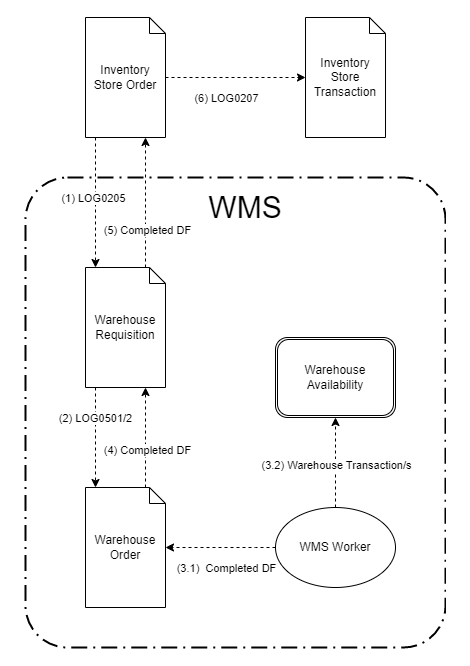

## Document flow in WMS

The link between other modules/processes in the system and the WMS is performed through the Inventory module. And more precisely, the document that communicates with the WMS Module is the Inventory Store order. 

The Store Order creates both:
-	the Warehouse Requisition that inform the WMS Module what is requested by the other modules/processes;
-	and the Store Transaction, which contains the information how these requests are actually fulfilled by WMS module.

## How it works?
Here is the scheme of the document and execution flow. The flow can be can be divided into two practical phases:
- **generation and execution** - steps (1) - (3.1)
  AND
- **completion** - steps (3.2) - (6)

### Generation and execution

**(1) The Store Order (SO)** generates a **Warehouse Requisition (WR)** using the [LOG0205](https://docs.erp.net/model/generations/LOG0205.html) generation procedure. 

The Warehouse Requisition is the document that informs the WMS Module what is requested by the other modules/processes. Usually the Warehouse Requisition is almost an exact copy of the Store Order. 

The document fulfillment between the SO and WR is calculated using the [Fulfillment table method](/advanced/document-flow/fulfillment.md#fulfillment-table). The generation procedure creates Planned Document Fulfillments, which records how much of the quantity of the WO lines has been fulfilled by WR lines.

**(2) The WR** generates a **Warehouse Orders (WO)** using the [LOG0501](https://docs.erp.net/model/generations/LOG0501.html) or [LOG0502](https://docs.erp.net/model/generations/LOG0502.html) generation procedure, depending on wherther composite products are used or not.

The Warehouse Order is the document that contains the actual plan that needs to be executed by the WMS module. The generation of its lines is the place where all plan optimizations, algorithms, and AI should happen. 

The document fulfillment between the WR and WO is also calculated using the [Fulfillment table method](/advanced/document-flow/fulfillment.md#fulfillment-table). The generation procedure creates Planned Document Fulfillments, which records how much of the quantity of the WR lines has been fulfilled by WO lines.

**(3) The released WO** load in the Orders menu of [WMS Worker](xref:wms-worker), where they are executed by the warehouse workers using the handheld devices.
Each line execution generates 2 real time records:
- **(3.1** Warehouse Transaction - which updates the availability according to the workes actions (move, dispatch, receive)
- **(3.2)** Completed Document Fulfillment - which records how much of the quantity of the WO lines has been fulfilled by the workers and with what details (product, lot, variant)

### Completion
This phase practically starts in step (3.2) and more precisely, when the step is fullly completed. 

The completion process is triggered by the warehouse workers but it is usually finished by the person controlling the flow of processes in the warehouse - the warehouse dispatcher or manager. The WO's are usually completed by the workers, while the WR and SO are completed by the person that performs the control.

The steps: 
**(3.2) When all WO lines are fully executed** and have Completed Document Fulfillments, then the **WO document state is changed to Completed** by the worked. Its state is usually changed by the warehouse workers, using the "Complete order" button that shows automatically on their devices after the execution of the last order line.

**(4) Once the WO's state is changed to Completed** it brings the fulfillment information (quantity, product, lot, variant) back to the **parent WR**. The information is brough by generating Completed Document Fulfillment for the **WR** using the [R33563](https://docs.erp.net/model/business-rules/R33563.html) business rule. Note that, the rule will be triggered only if "Complete Parent Fulfillments" field in the WO's DocumentType is checkmarked.

**(4) Once the WR's state is changed to Completed** it brings the fulfillment information (quantity, product, lot, variant) back to the **parent SO**. The information is again brough by generating Completed Document Fulfillment for the **SO** using the [R32687](https://docs.erp.net/model/business-rules/R32687.html) business rule. Note that, the rule will be triggered only if "Complete Parent Fulfillments" field in the WR's DocumentType is checkmarked.

**(5) Once the SO's state is changed to Completed** it generates a **Store Transaction (ST)** using the [LOG0207](https://docs.erp.net/model/generations/LOG0207.html) generation procedure. The ST line creation is based on the fulfillment information (quantity, product, lot, variant) of the WMS module, which is contained in the  parent SO's completed fulfillments.

