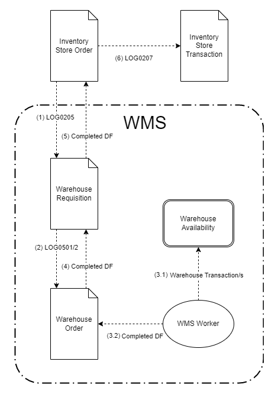

## Document flow in WMS

The link between other modules/processes in the system and the WMS is performed through the Inventory module. 
And more precisely, the document that communicates with the WMS Module is the Inventory Store order. 
The Store Order creates both:
-	the Warehouse Requisitions that inform the WMS Module what is requested by the other modules/processes;
-	and the Store Transaction, which returns the information how these requests are actually fulfilled by WMS module.

How it works?
Here is the scheme of the document and execution flow.

