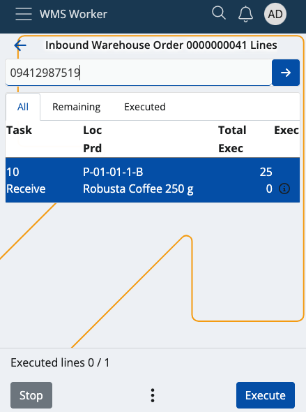
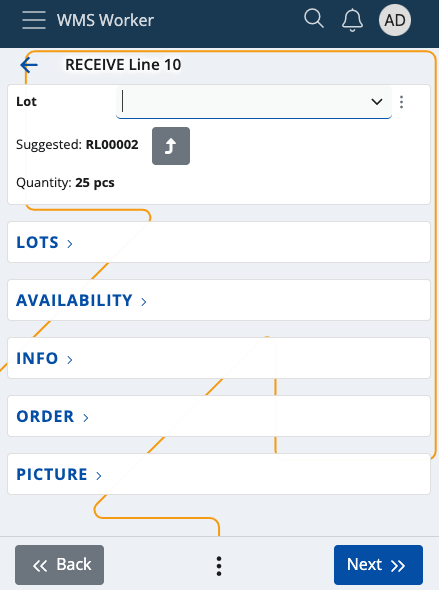
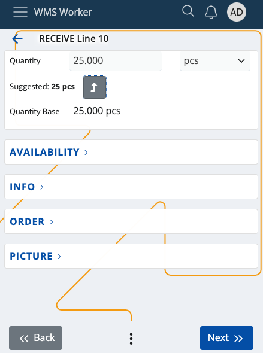
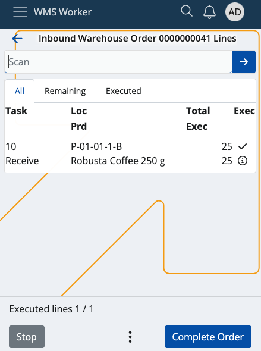

# Recalculating quantities in the WMS Worker 

If a product has a defined additional **coding system** with a default base measurement category, it is possible to **recalculate** the product's quantities when scanning in the WMS Worker app.

**For example:**

You have an order which contains dozens of pcs of coffee which arrive in a box with its own unique code. The box is defined for the coffee as a coding system and has a default base measurement category of 20 pcs. You will be able to instantly execute **20 pcs** of coffee with a **single** scan of the box's product code. This **overrides** the product's own default unit.

If no measurement category is set, the product will still be recognized but its default unit (e.g. 1pcs) will be taken into account instead.

### Prerequisites

1. Make sure your product has a defined **[coding system](/modules/general/products/coding-systems.md)**.
   
    You can find a list of all coding systems and create new ones on-demand in the **Web Client**.

   

3. Use the **[WMS Worker App](/modules/logistics/wms/wms-worker/index.md)** to open an order and scan the product code of the coding system of the product(s).

## How it works

Assuming your order consists of a box with several instances of products, you can scan their coding system's product code right away.

1. Within the **SCAN** field, provide the respective code, or use your mobile device to scan the barcode of the box.

   
   
2. The standard **Quantity** step will be skipped and you will only need to select a **lot**.

   

3. You will get an **auto-suggested** product quantity based on the provided measurement unit of the coding system.

   

4. Tap **Next** to confirm the operation. Several or all pcs of your product will be executed **instantly**.

   

> [!NOTE]
> You can **multiply** a coding system's code just like a regular product unit. For instance, if the coding system has a default measurement unit of 25pcs, multiplying it by 4 will give you 100pcs of the product ready to be scanned in one-go.

