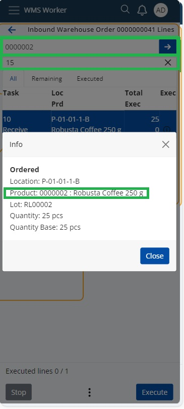
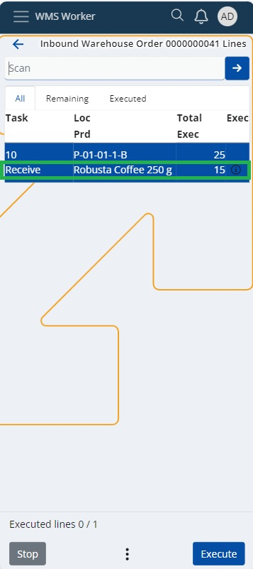
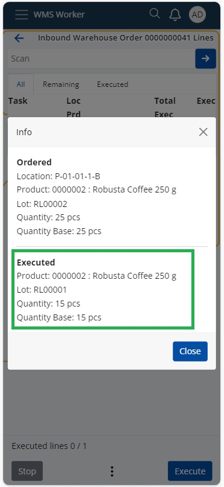

# Using the SCAN field in WMS worker

The SCAN field in the Warehouse Order Lines menu of the WMS Worker app allows you to scan and recognize various types of [Barcode Parsers](https://docs.erp.net/tech/modules/logistics/wms/how-it-works/barcode-parsers/index.html?q=Barcode%20Parsers%20|%20ERP.net%20Tech%20Docs). 
## How to use it:
Depending on the [Config options settings](https://docs.erp.net/tech/reference/config-options-reference.html#54-wmswms-workersinglebarcodescanentersquantityofonepce), the system can automatically enter a [quantity of one pace](https://docs.erp.net/tech/modules/logistics/wms/how-to/setup-warehouse/enter_quntity_of_one_pce.html) for the product when scanned or when the product code is entered. Alternatively, you can use the option for automatic quantity entry to skip the Quantity screen.

The SCAN field also provides a quick option for entering or scanning larger quantities of the selected product. Simply enter the total quantity and press "OK" or "Enter," after which you can scan the product's barcode or enter the product code. In this way, the Quantity screen will not be displayed. You can even sum up sequentially entered quantities for a single product.

## Example:
If you expect to receive 25 units of the product "Robusta Coffee 250 g" for Inbound Warehouse Order 0000000041, you can enter "5 OK/Enter" and then "10 OK/Enter." 

The system will automatically sum the quantities, and you can scan the product's barcode or enter the product code and confirm with "OK/Enter." This results in a total of 15 executed units out of the expected 25.

> [!NOTE]
> For quantities up to 999, simply enter the digit and press "OK/Enter," while for quantities above 1000, add "*" after the digit and then press "OK/Enter.
