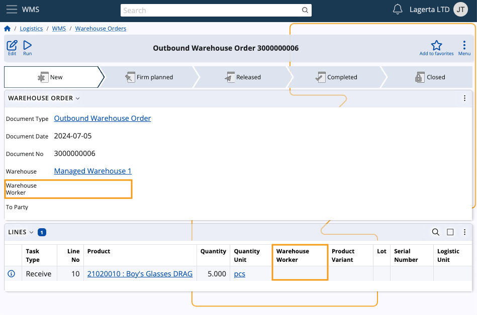
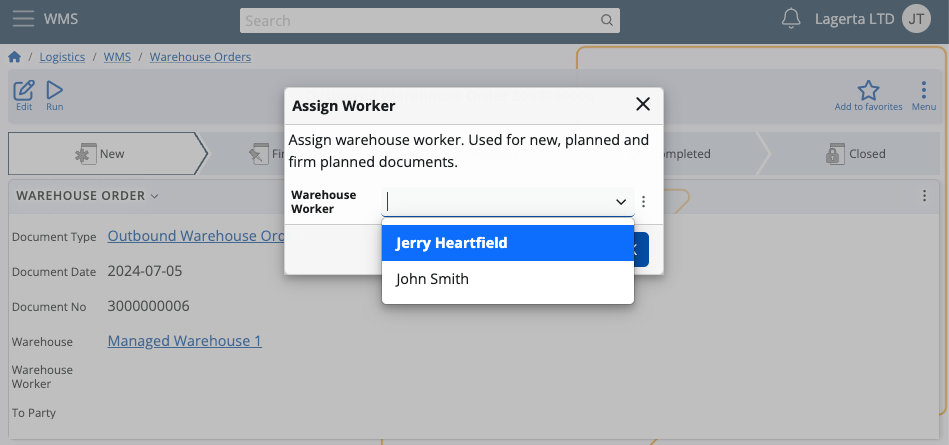
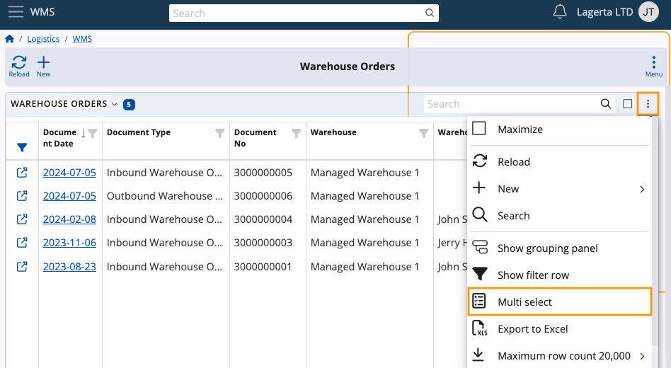
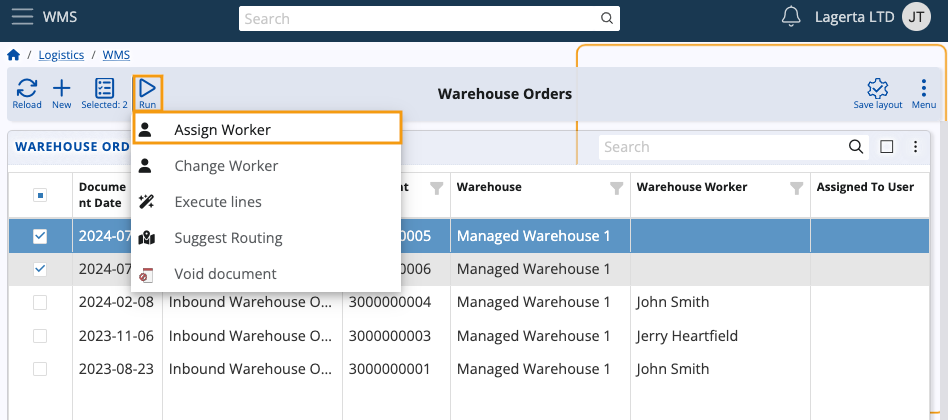
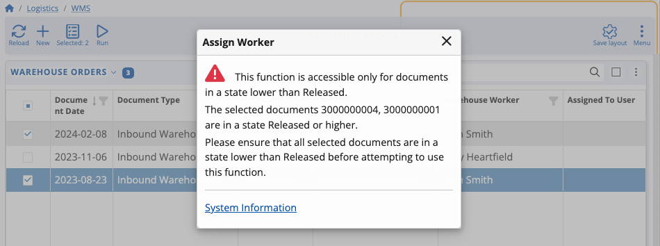

# Assign worker

The **Assign worker** UI function allows setting a worker responsible for a task in a warehouse order document. 

> [!NOTE]
> This function is accessible only for Warehouse Orders in a state **lower** than Released.
> If the current document is Released, you can **change** the worker by using the [Change Worker UI function](change-worker.md).

## Step-by-step guide

1. Open a warehouse order in a state New, Planned or Firm planned.

   

2. Click on the **Run** button and choose **Assign worker**.
  
   

3. This action triggers a dropdown list of available warehouse workers. The displayed workers are filtered based on the warehouse selected in the document.

   Select the preferred worker from the dropdown list and confirm your choice by clicking **OK** This executes the function.

   

4. After refreshing the document, the **Warehouse Worker** field will show the selected worker.

   

## Assign multiple workers

Using the **[Multi select](https://docs.erp.net/webclient/introduction/navigator-features.html#panel-menu)** UI feature embedded into panels, you can assign workers to multiple warehouse orders simultaneously.

This saves time and effort as you don't have to go through each order individually.

1. Navigate to your **Warehouse Orders** list and choose **Multi select** from the panel's menu.

  

2. Select two or more warehouse orders with or without workers assigned. Make sure they are **all** in a state lower than Released.
   
   Then, click the **Run** button and execute the **Assign worker** function.

   

3. Choose a worker to assign and hit **OK**.

   

   The selected worker will be immediately assigned to the respective orders.

   If you happen to choose an order in a state Released or higher, the function will result in an **error**.

   

