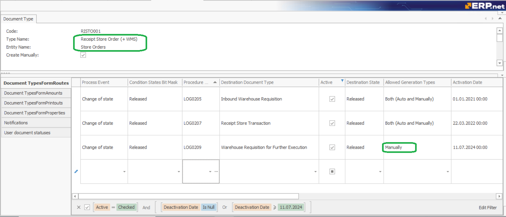
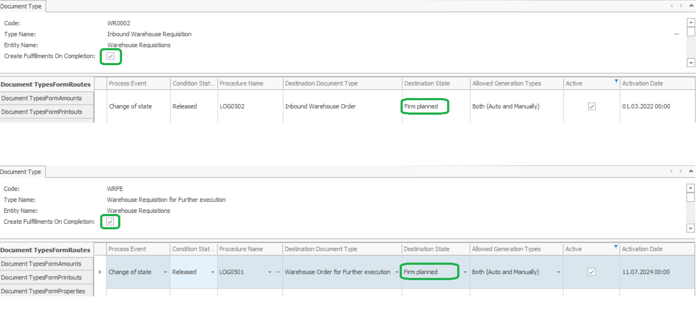

## Document flow in WMS

The link between other modules/processes in the system and the WMS module is performed through the Inventory module. And more precisely, the document that communicates with the WMS module is the Inventory Store Order. 

The Store Order creates both:
-	the Warehouse Requisition that informs the WMS module what is requested by the other modules/processes;
-	and the Store Transaction, which contains the information on how these requests are actually fulfilled by the WMS module.

## How set it up?
Here is the scheme of the document and execution flow. The flow can be divided into two general phases:
- **generation and execution** - steps (1) - (3.1)
  AND
- **completion** - steps (3.2) - (6)

### Generation and execution phase
This phase starts with the release of the Store Order.

**(1) The Store Order (SO)** generates a **Warehouse Requisition (WR)** using the [LOG0205](xref:LOG0205) generation procedure. 

The Warehouse Requisition is the document that informs the WMS Module what is requested by the other modules/processes. Usually, the Warehouse Requisition is almost an exact copy of the Store Order. 

The document fulfillment between the SO and WR is calculated using the [Fulfillment table method](/advanced/document-flow/fulfillment.md#fulfillment-table). The generation procedure creates **Planned Document Fulfillments (DF)**, which records how much of the ordered quantity of the **SO lines** has been fulfilled by **WR lines**.

**(2) The WR** generates a **Warehouse Order (WO)** using the [LOG0501](xref:LOG0501) or [LOG0502](xref:LOG0502) generation procedure, depending on whether the organization uses @composite-products or not.

The Warehouse Order is the document that contains the actual plan that needs to be executed by the WMS module. The generation of its lines is the place where all plan optimizations, algorithms, and AI should happen. 

The document fulfillment between the **WR and WO** is also calculated using the [Fulfillment table method](/advanced/document-flow/fulfillment.md#fulfillment-table). The generation procedure creates **Planned DF**, which records how much of the quantity of the **WR lines** has been fulfilled by **WO lines**.

**(3) The released WO** loads in the Orders menu of **[WMS Worker](xref:wms-worker)**, where it is executed by the warehouse workers using the handheld devices.
When a **WO line** is executed, the system generates 2 real-time records:
- **(3.1) Warehouse Transaction** - which updates the availability according to the workers actions (move, dispatch, receive);
- **(3.2) Completed DF** - which records how much of the quantity of the WO lines has been fulfilled by the workers and with what details (product, lot, variant).

### Completion phase
This phase practically starts in step (3.2) and more precisely, when the step is fully completed. 

The completion process is triggered by the warehouse workers but it is usually finished by the person controlling the flow of processes in the warehouse - the warehouse dispatcher or manager. 

**(3.2) When all WO lines are fully executed** and have Completed Document Fulfillments, then the **WO document can be Completed**. 

Its state is usually changed by the warehouse workers, using the "Complete order" button that shows automatically on their devices after the execution of the last order line.

**(4) Once the WO's state is changed to Completed** it brings the fulfillment information (quantity, product, lot, variant) back to the **parent WR**. 

The information is brought by generating **Completed DF** for the **WR** using the [R33563](https://docs.erp.net/model/business-rules/R33563.html) business rule. Note that, the rule will be triggered only if the "Complete Parent Fulfillments" field in the WO's DocumentType is checkmarked.

**(5) Once the WR's state is changed to Completed** it brings the fulfillment information (quantity, product, lot, variant) back to the **parent SO**. 

The information is again brough by generating **Completed DF** for the **SO** by another rule [R32687](https://docs.erp.net/model/business-rules/R32687.html). Note that, the rule will be again triggered only if the "Complete Parent Fulfillments" field in the WR's DocumentType is checkmarked.

The **WR** is usually completed by the warehouse dispatcher or manager. "When?" depends on the method of control that has been chosen by the organization:
* **two-stage control** - by completing the WR and then completing the SO
 OR
* **one-stage control** - by automatically completing the WR during the completion of the SO

If the organization **uses two-stage control** the warehouse dispatcher or manager can track which **WRs** are fully executed using the **Warehouse Requisition navigator** that contains a "Is Executed* calculated attribute that has been set up in advance. The calculated attribute expressions are added at the end of this topic. Then, the executed documents can be completed using the bulk function "Change state of selected documents => Completed" in the same navigator.

If the organization uses the **one-stage control**, the **WR** is completed in step (5).

**(6) Once the SO's state is changed to Completed** it generates a **Store Transaction (ST)** using the [LOG0207](xref:LOG0207) generation procedure. The **ST lines** creation is based on the fulfillment information (quantity, product, lot, variant) of the WMS module, which is contained by the **parent SO's** completed fulfillments.

The **SO** is usually completed by the warehouse dispatcher or manager. He can track which **SOs** are fully executed by the WMS module using the **Store Orders navigator** that contains a "Is Executed* calculated attribute that has been set up in advance.  The calculate attribute expressions are added at the end of this topic.

If the organization **uses two-stage control**, the executed **SOs** are completed using the bulk function "Change state of selected documents => Completed" in the
**Store Orders navigator**.

If the organization uses the **one-stage control**, the executed **SOs** are completed along with their child **WR's** the bulk function "Change state of selected documents => Complete with subdocuments" in the same navigator.

### Generation for further execution (manual generation only)

In Warehouses is not always possible to execute all of the ordered quantities. 
For example, there is no availability of some products to Dispatch all of them or the supplier sent less quantity from the order and you can't Receive it all.  
In this case, you have to complete the Warehouse Order with the quantities you have at the moment.  
When you already have the missing quantities and you want to execute them from the same **SO**, you can manually start [LOG0209](xref:LOG0209) generaton. 
This generation will create a new **WR** for the differences between the ordered quantities in the **SO** and the executed quantities from the Completed fulfillments. 
You can start this generation every time you want to make a **WR** for further execution.

> [!Note]
> You have to set up this Generation in the Document flow by using only Manually in the Allowed generation types field.

### Recommended settings for the Document flow and Document Types

##### Document Types: 
- create different Document types for Receipt and Issue Store Order, which are used only for WMS; 
- create different Document types for Straight and Further Warehouse Requisitions, separated by movement type;
- create different Document types for Straight and Further Warehouse Orders, separated by movement type;
- set True to "Create Fulfillments On Completion" field in the WR and WO document types - this is required to bring the fulfillments from WO through WR to SO. 

##### Store Order Document Flow settings:

(1) To set up creation of **Warehouse Requisiton** some of the fields in the Route should be set as:

 - Process Event - Change of state;
 - Condition States Bit Mask - Released;
 - Procedure Name - [LOG0205](xref:LOG0205)
 - Allowed Generation Types - Both (Auto and Manually)
 - Destination State - Released;

(2) To set up creation of **Store Transaction** the fields in the Route should be set as:

 - Process Event - Change of state;
 - Condition States Bit Mask - Released,Completed - the completed state is used when you don't want to do any further executions;
 - Allowed Generation Types - Both (Auto and Manually)
 - Procedure Name - [LOG0207](xref:LOG0207);
 
(3) To set up creation of **Warehouse Requisiton for Further Execution** some of the fields in the Route should be set as:

 - Process Event - Change of state;
 - Condition States Bit Mask - Released;
 - Procedure Name - [LOG0209](xref:LOG0209);
 - Allowed Generation Types - **Manually**
 - Destination State - Released;
 

##### Warehouse Requisition Document Flow settings:

To set up creation of **Warehouse Order** some of the fields in the Route should be set as:

 - Process Event - Change of state;
 - Condition States Bit Mask - Released;
 - Procedure Name - [LOG0501](xref:LOG0501);
 - Allowed Generation Types - Both (Auto and Manually)
 - Destination State - **Firm Planned** - the WO should be created to Firm Planned state because you have to assign a Worker for it. Depending on the Warehouse processes you can Assign Workers one by one or use [Assign Worker for multiple rows UI function](assign-worker.md). You also can leave the Order without Assignment so the Workers can Take the Orders by themselves through the WMS Worker before they start to execute it;

### "Is Executed" calculated attributes

The information whether the **WR or a SO** is fully executed is collected using three calculated attributes. They allow us to have that information on three different stages of the Completion phase which are of great importance:
* an attribute in **WR lines** - that shows if the particular line is fully executed
* a second attribute in **WR** - that uses the first attrute that shows if the whole **WR** is fully executed i.e. if all of its lines are.
* and a third attribute in **SO** - that shows if the document is fully executed by the WMS module i.e. if all its child **WRs** are fully executed.

Here is a list with the calculated attribute expressions. Of course, еach attribute can be modified by the implementatior according to the organization's needs.

> **_NOTE:_** You can easily create these attributes in your database by copy-pasting their expression into your database.

* "Is Executed" attribute in **WR lines**

Repository: Logistics.Wms.WarehouseRequisitionLines

| Exp No | Operator | Parameter1 | P1 Value | Parameter2 | P2 Value | Parameter3 | P3 Value |
| ------ | -------- |----------- |--------- |----------- |--------- |----------- |--------- |
| 	10	 | 	IIF	 | 	EXP	 | 	20	 | 	CONST	 | 	TRUE	 | 	CONST	 | 	FALSE	 |
| 	20	 | 	LTE	 | 	EXP	 | 	30	 | 	EXP	 | 	100	 |				
| 	30	 | 	SUM	 | 	EXP	 | 	40	 | 	ATTRIB	 | 	StandardQuantity	 |				
| 	40	 | 	FILTER	 | 	EXP	 | 	50	 | 	EXP	 | 	60	 |				
| 	50	 | 	GETOBJVALUE	 | 	REF	 | 	WarehouseRequisition	 | 	CHILD	 | 	Fulfillments	 |				
| 	60	 | 	AND	 | 	EXP	 | 	70	 | 	EXP	 | 	90	 |				
| 	70	 | 	EQUAL	 | 	ATTRIB	 | 	DocumentLineId	 | 	EXP	 | 	80	 |				
| 	80	 | 	GETOBJVALUE	 | 	INPUT	 | 	10	 | 	ATTRIB	 | 	Id	 |				
| 	90	 | 	EQUAL	 | 	EXP	 | 	95	 | 	CONST	 | 	0	 |				
| 	95	 | 	CAST	 | 	ATTRIB	 | 	FulfillmentType	 | 	CONST	 | 	System.Int32	 |				
| 	100	 | 	SUM	 | 	EXP	 | 	110	 | 	ATTRIB	 | 	StandardQuantity	 |				
| 	110	 | 	FILTER	 | 	EXP	 | 	120	 | 	EXP	 | 	130	 |				
| 	120	 | 	GETOBJVALUE	 | 	REF	 | 	WarehouseRequisition	 | 	CHILD	 | 	Fulfillments	 |				
| 	130	 | 	AND	 | 	EXP	 | 	140	 | 	EXP	 | 	160	 |				
| 	140	 | 	EQUAL	 | 	ATTRIB	 | 	DocumentLineId	 | 	EXP	 | 	150	 |				
| 	150	 | 	GETOBJVALUE	 | 	INPUT	 | 	10	 | 	ATTRIB	 | 	Id	 |				
| 	160	 | 	EQUAL	 | 	EXP	 | 	170	 | 	CONST	 | 	1	 |				
| 	170	 | 	CAST	 | 	ATTRIB	 | 	FulfillmentType	 | 	CONST	 | 	System.Int32	 |				

* "Is Executed" attribute in **WR**

Repository: Logistics.Wms.WarehouseRequisitions

| Exp No | Operator | Parameter1 | P1 Value | Parameter2 | P2 Value | Parameter3 | P3 Value |
| ------ | -------- |----------- |--------- |----------- |--------- |----------- |--------- |
| 	10	 | 	IIF	 | 	EXP	 | 	20	 | 	CONST	 | 	FALSE	 | 	CONST	 | 	TRUE	 |
| 	20	 | 	GTE	 | 	EXP	 | 	30	 | 	CONST	 | 	1	 |				
| 	30	 | 	COUNT	 | 	EXP	 | 	40	 | 		 | 		 |				
| 	40	 | 	FILTER	 | 	CHILD	 | 	Lines	 | 	EXP	 | 	50	 |				
| 	50	 | 	EQUAL	 | 	ATTRIB	 | 	#IsExecutedWRLines	 | 	CONST	 | 	FALSE	 |				

* "Is Executed" attribute in **SO**

Repository: Logistics.Inventory.StoreOrders

| Exp No | Operator | Parameter1 | P1 Value | Parameter2 | P2 Value | Parameter3 | P3 Value |
| ------ | -------- |----------- |--------- |----------- |--------- |----------- |--------- |
| 	10	 | 	IIF	 | 	EXP	 | 	20	 | 	CONST	 | 	FALSE	 | 	CONST	 | 	TRUE	 |
| 	20	 | 	GTE	 | 	EXP	 | 	30	 | 	CONST	 | 	1	 |				
| 	30	 | 	COUNT	 | 	EXP	 | 	31	 | 		 | 		 |				
| 	31	 | 	FILTER	 | 	EXP	 | 	40	 | 	EXP	 | 	32	 |				
| 	32	 | 	EQUAL	 | 	ATTRIB	 | 	#IsExecutedWR	 | 	CONST	 | 	FALSE	 |				
| 	40	 | 	SELECT	 | 	REPO	 | 	Logistics.Wms.WarehouseRequisitions	 | 	EXP	 | 	50	 |				
| 	50	 | 	WHERE	 | 	EXP	 | 	60	 | 		 | 		 |				
| 	60	 | 	EQUAL	 | 	ATTRIB	 | 	ParentDocumentId	 | 	EXP	 | 	70	 |				
| 	70	 | 	GETOBJVALUE	 | 	INPUT	 | 	10	 | 	ATTRIB	 | 	DocumentId	 |				

