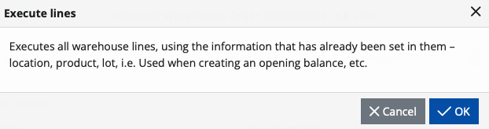

# How to execute order lines?
The **Warehouse Order (WO)** is the document that contains the actual plan that needs to be executed by the WMS module. 

The lines of the **WO** can be executed trough the Orders menu of the [WMS Worker](xref:wms-worker) or through the **Execute lines** UI function.

How these lines are executed, depends on their [Task type](/modules/logistics/wms/how-it-works/task-types/index.md). More information about the purpose of each task type and how it can be executed can be found in the 
[Task type](/modules/logistics/wms/how-it-works/task-types/index.md) subtopics.

Note that, not all task types are currently available for order lines execution. Some, such as the [Count task type](/modules/logistics/wms/how-it-works/task-types/count.md) for example, 
are available only as ad hoch operation (e.g. the Renciliation menu of the WMS Worker).

## Orders menu in WMS Worker
[WMS Worker](xref:wms-worker) is our WMS mobile application available on all compatible Android devices, including handheld devices. 
The Orders menu is used by the warehouse worker to execute the lines of the warehouse orders that has been assigned to them. For more information see [WMS Worker](xref:wms-worker) 

## Execute lines UI function 

The "Execute lines" UI function available in the definition of the Warehouse Orders.

When started, it executes the warehouse order lines according to the information specified in them - product, quantity, lot, serial number, etc.. As a result, it creates Warehouse Transactions, Document Fulfillments or both, depending on the particular line's [task type](/modules/logistics/wms/how-it-works/task-types/index.md).  The function is especially useful when [entering initial availability](/modules/logistics/wms/how-to/initial-availability.md) in the Warehouse or as a backup way to execute lines without using the [WMS Worker](xref:wms-worker) app, in case there is a problem with mobile devices for example.

To begin, go to the definition of the Warehouse Order you would like to execute. Make sure that its state is **released** and if it is not, **release** the document before starting the function.

Then, click the **UI Functions** and select **Execute lines**.

You'll get a confirmation message preceding the operation. Confirm that you want to perform it by clicking **OK**.

The line execution functionality processes every line separately, and if the execution of all lines is successful, the function will finish with a success message. 

If there's problem during the execution of the lines, the function will stop running and will display a message giving more details about the problem and its cause.

Once the error is identified and resolved, you can continue the execution process from where it was stopped. The system will automatically detect the unexecuted lines left from the previous attempt (based on the Document Fulfillments that has been created) and proceed with their execution.
