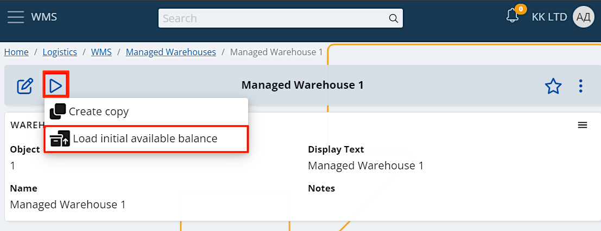
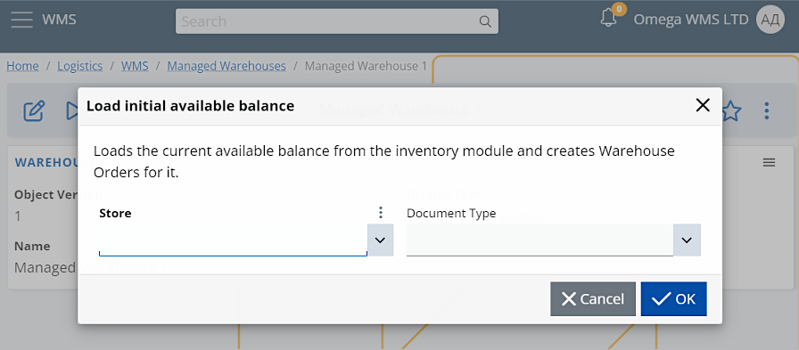
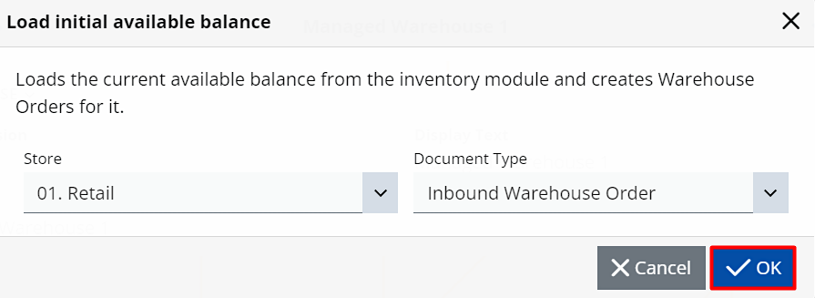
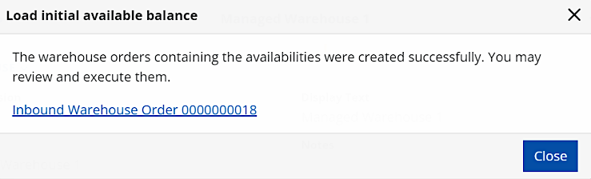

# Easy entry of initial availability balances

When working in the WMS module, one of the first things you need to do is enter the **initial availability balance**. 

This allows you to keep consistent track of what your warehouse has and never get lost in random numbers. 

For ease of management purposes, the system has **two** functionalities set in place – one for loading the availability and another for executing the lines.

## Loading the initial warehouse availability

While defining your warehouse in the WMS module, you can load the initial availability by selecting one of your existing stores.

To begin, click on the **play button** and select **Load initial available balance**.

A separate window will visualize, in which you need to select a store and define the type of the document.

The store provides you with initial availability while the document type is used for issuing warehouse orders.

Once you’ve made your selections, click OK.

Availabilities from the selected store will be loaded, and you'll receive a message containing the link(s) of the issued orders that belong to the respective warehouse.

If you click on the link, you’ll be taken to the contents of the order. You can preview, edit and execute it on demand.

## Executing the lines

The next step in working with initial availabilities is the execution of warehouse order lines.

This essentially loads what’s left of the (unprocessed) quantities from all document lines which are part of a warehouse order. Already provided information such as line number, product and serial number is used in the process.

Line execution is useful if you're creating opening balances, but it can also help when a specific warehouse order needs to be issued without using an WMS worker.

To begin, go to the contents of a warehouse order (inbound or outbound) and make sure to **release** it.

Then, click the **play button** and select **Execute lines**.

You'll get a warning message preceding the operation. Confirm that you want to perform it by clicking **OK**.

The line execution functionality processes every line separately, and if everything is alright, you should get a success message. 

Furthermore, one or two documents will be generated as a result: store transaction and/or document fulfillment. 

If there's an error during the execution of the lines, a different message will be displayed on the screen, putting the operation to a halt. 

Once the error is identified and removed by an operator, you can continue the execution process from where it was stopped.
