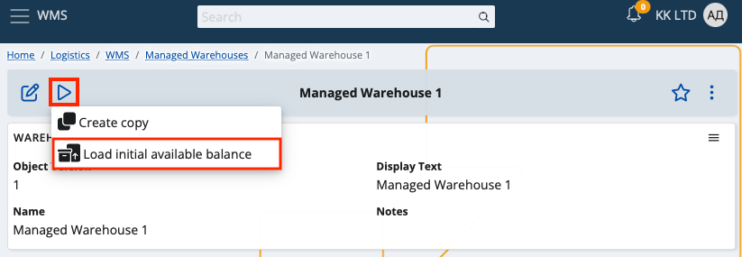
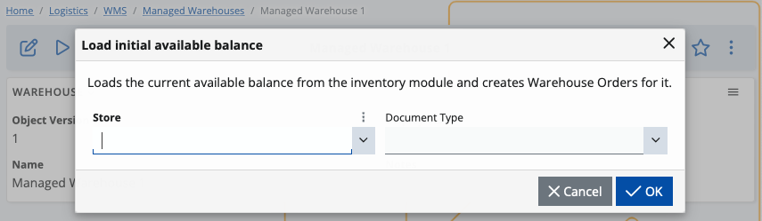
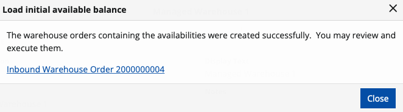

# Enter initial availability

When working in the WMS module, one of the first things you need to do is enter the **initial availability balance**. 

The system comes with two functions that will help you ease the process – one for loading the current availability from the Inventory module and another that will apply the reviewed availability to the WMS module.

Here are more details on what they do and how to use them.

## Loading the inventory availability using the 'Load initial available balance' UI function

The first function is located in the Managed Warehouse definition. 

With it, you can enter availability for the current Warehouse by loading the current availability from an existing Store of the Inventory management module. 

The function loads availability from the selected Store and creates Warehouse Orders for the corresponding Warehouse. The lines of these Warehouse Orders contain the loaded availability.  Then, they can be reviewed, edited (if necessary), and executed by the second function.

To begin, click on the **UI Functions button** and select **Load initial available balance**.

This will pop up a window, in which you can select the **Store** whose availability you would like to load and the **Document type** of the Warehouse Order that will be created.

Once you’ve made your selections, click OK.

The availabilities from the selected store will be loaded, and you'll receive a message containing the link(s) with the created document/s that contains the result. Click on the link to open the definition of the created order/s. 

## Review and edit the results

When you open the definition of the created order/s, you can review and edit the results of the previous function i.e. the warehouse order lines.

The information specified in these lines will be directly used to form the availability. 

Therefore this is the step, where you should review the quantities, assign the Warehouse Locations and the @LU (if any), and make any additional changes to the information in the lines to achieve the desired availability. 

Please specify a warehouse worker as well, as it is a required field to release the document. You can select any worker you prefer.

## Execute the lines to form the availability

Once all the information in the lines is filled and reviewed, it is time to release the document and execute its line using the second function - the "Execute lines" function. For more information about the function and how to use it, see the ["Execute lines UI function"](https://docs.erp.net/tech/modules/logistics/wms/how-to/execute-order-lines.html#execute-lines-ui-function).
