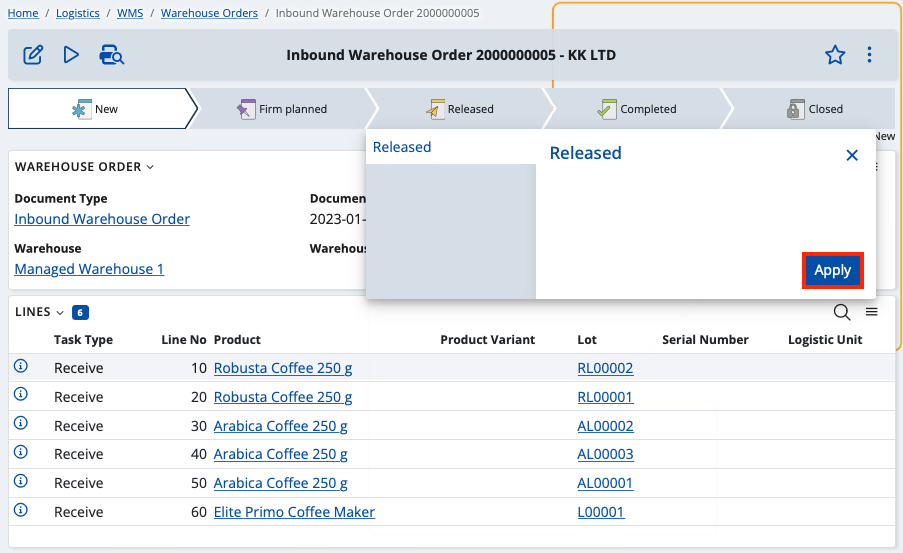

# Enter initial availability

When working in the WMS module, one of the first things you need to do is enter the **initial availability balance**. 

The system comes with two functions which will help you ease the process – one for loading the current availability from the Inventory module and another that will aplly the reviewed availability into the WMS module

## Loading the initial warehouse availability

The first function is located in the Managed Warehouse definition. 

With it, you can enter availability for the current Warehouse by loading the current availability from an existing Store of the Inventory management module. 

The function loads availability from the selected Store and creates Warehouse Orders the for the corresponding Warehouse. The lines of these Warehouse Orders contain the loaded availability. They can be review, changed (if neececeray) and executed by the second function.

To begin, click on the **UI Functions button** and select **Load initial available balance**.

This will popup a window, in which you can select the Store whoose availability you want to load and the document type of the Warehouse Order that will be created.

Once you’ve made your selections, click OK.

The availabilities from the selected store will be loaded, and you'll receive a message containing the link(s) with the created document/s that contain the result.

If you click on the link, you’ll be taken to the definition of the order. There you can review and edit (if needed) the results i.e. the warehouse order lines. Once review is done,  you can release the document and execute its line using the second function.

## Executing the lines

The next step in the entering of the availabilities is the execution of warehouse order lines. Once the information in them is reviewed and the document is released, the information in them is applied to the Warehouse Availability using this function.

The "Execute lines function" executes the warehouse order lines according to the information specified in them - product, quantity, lot, serial number etc. and creates Warehouse Transaction, Document Fulfillments or both.

This essentially loads what’s left of the (unprocessed) quantities from all document lines which are part of a warehouse order. Already provided information such as line number, product and serial number is used in the process.

Line execution is useful if you're creating opening balances, but it can also help when a specific warehouse order needs to be issued without using an WMS worker.

To begin, go to the contents of a warehouse order (inbound or outbound) and make sure to **release** it.

Then, click the **play button** and select **Execute lines**.

You'll get a warning message preceding the operation. Confirm that you want to perform it by clicking **OK**.

The line execution functionality processes every line separately, and if everything is alright, you should get a success message. 

Furthermore, one or two documents will be generated as a result: store transaction and/or document fulfillment. 

If there's an error during the execution of the lines, a different message will be displayed on the screen, putting the operation to a halt. 

Once the error is identified and removed by an operator, you can continue the execution process from where it was stopped.
