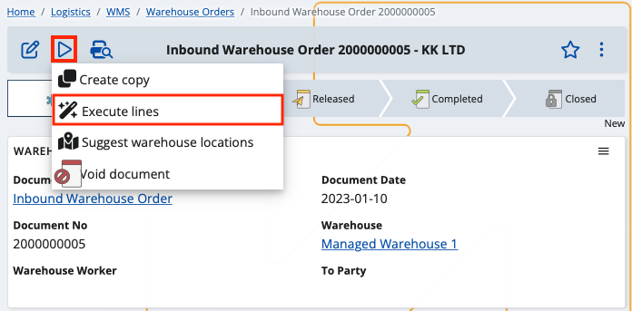

# Enter initial availability

When working in the WMS module, one of the first things you need to do is enter the **initial availability balance**. 

The system comes with two functions that will help you ease the process – one for loading the current availability from the Inventory module and another that will apply the reviewed availability to the WMS module.

## Loading the initial warehouse availability

The first function is located in the Managed Warehouse definition. 

With it, you can enter availability for the current Warehouse by loading the current availability from an existing Store of the Inventory management module. 

The function loads availability from the selected Store and creates Warehouse Orders the for the corresponding Warehouse. The lines of these Warehouse Orders contain the loaded availability.  Then, they can be reviewed, edited (if necessary), and executed by the second function.

To begin, click on the **UI Functions button** and select **Load initial available balance**.

This will pop up a window, in which you can select the **Store** whose availability you would like to load and the **Document type** of the Warehouse Order that will be created.

Once you’ve made your selections, click OK.

The availabilities from the selected store will be loaded, and you'll receive a message containing the link(s) with the created document/s that contains the result.

If you click on the link, you’ll be taken to the definition of the order. There you can review and edit (if needed) the results i.e. the warehouse order lines. Once the review is done,  you can release the document and execute its line using the second function.

## Executing the lines

The next step in entering the availabilities is the execution of warehouse order lines. Once the information in them is reviewed and the document is released, the information in them is applied to the Warehouse Availability using this function.

The "Execute lines function" executes the warehouse order lines according to the information specified in them - product, quantity, lot, serial number, etc.. As a result, it creates Warehouse Transactions, Document Fulfillments or both, depending on the particular line's [task type](/modules/logistics/wms/how-it-works/task-types/index.md). The function is especially useful when [entering initial availability](/modules/logistics/wms/how-to/initial-availability.md) in the Warehouse or as a backup way to execute lines without using the [WMS Worker](xref:wms-worker) app, in case there is a problem with mobile devices for example.

To begin, go to the definition of the Warehouse Order you would like to execute. Make sure that its state is **released** and if it is not, **release** the document before starting the function.

Then, click the **UI Functions** and select **Execute lines**.

You'll get a confirmation message preceding the operation. Confirm that you want to perform it by clicking **OK**.

The line execution functionality processes every line separately, and if the execution of all lines is successful, the function will finish with a success message. 

an informative message is displayed on the screen and the processing is interrupted.

If there's problem during the execution of the lines, the function will stop running and will display a message giving more details about the problem and its cause.

Once the error is identified and resolved, you can continue the execution process from where it was stopped. The system will automatically detect the unexecuted lines left from the previous attempt (based on the Document Fulfillments that has been created) and proceed with their execution.
