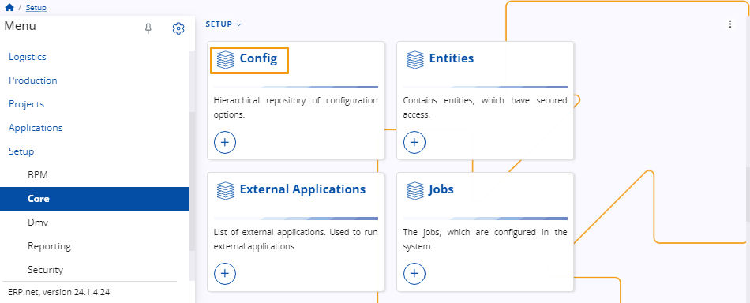

# Change order display format

In the **WMS Worker**, you have the ability to modify the information displayed for the **Orders**. 

This can be achieved using a **Configuration Key** that presents information through **String Interpolation**.

## Configuration Key

To change the information that is shown in **WMS Worker – Orders**, you need to use the **Configuration Key in Setup – Core – Config**.

When you do that, a table with all available configurations will open. 

Find the **Configuration** named **/WMS/WMS-Worker/OrderDisplayFormat** and open it. 

Once you’ve done that you can change the **Key Value** in the **Configuration** using [String Interpolation](https://docs.erp.net/tech/advanced/string-interpolation/index.html?q=string). 
The **String Interpolation** is taking values from the current **Warehouse Order – WarehouseOrder(id)**. 

Based on the **Key Value**, different information will be shown  about the orders.

## Behavior in particular cases 

Here is the expected behavior in some different cases:

•	If there is no **Configuration Key** set, the information displayed is retrieved from the **To Party** field. This is the default behavior.

•	If there is a **Configuration Key** set, but the **Key value** field is blank, the information displayed is also retrieved from **To Party** field.

•	There is a **Configuration Key** set, but the assigned parameters are not returning any value. The information displayed is going to be “-“.
