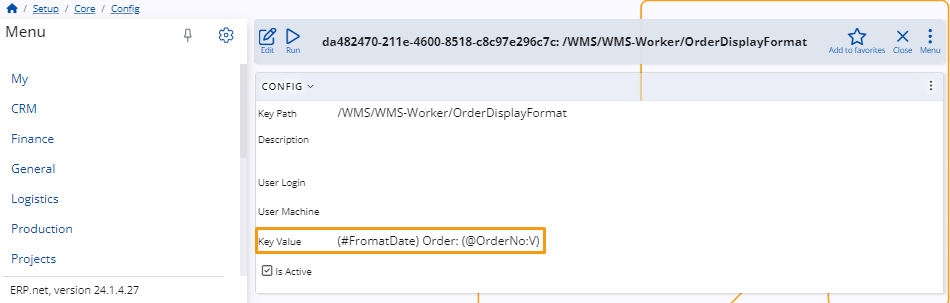

# Change order display format

You can decide exactly what kind of information is displayed for each of your **orders** in the WMS Worker.

This can be achieved using a **configuration key** specified in an appropriate **[string interpolation](https://docs.erp.net/tech/advanced/string-interpolation/index.html?q=string)** format.

Having access to order data before you even take it allows you to instantly learn what it's about even if a few basic details are provided.

## How to do it

To change the information that is displayed for your orders, you need to configure the **OrderDisplayFormat** key.

You can find it in the **[Config options reference](https://docs.erp.net/tech/reference/config-options-reference.html#55-wmswms-workerorderdisplayformat)**.

Once you open the key, change the **Key Value** in the configuration using [string interpolation](https://docs.erp.net/tech/advanced/string-interpolation/index.html?q=string). 

Based on what you provide for **Key Value**, different information will be displayed for all of your orders in the WMS Worker.

### Behavior in particular cases 

Here is the expected behavior of changing the order display format in certain cases:

•	If there is **no** config key set, the information displayed will be retrieved from the **To Party** field. This is the default behavior.

•	If there is a key set, but the **Key Value** field is left blank, the displayed information will also be retrieved from **To Party** field.

•	If there is a config key set, but the assigned parameters are **not** returning any value, the displayed information is going to be “-“.
