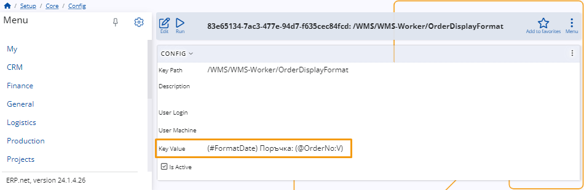

# Change order display format

You can decide exactly what kind of information is displayed for each of your **orders** in the WMS Worker.

This can be achieved using a **configuration key** specified in an appropriate **[string interpolation](https://docs.erp.net/tech/advanced/string-interpolation/index.html?q=string)** format.

## How to do it

To change the information that is displayed for your orders, you need to configure the **OrderDisplayFormat** key.

You can find it in the **[Config options reference](https://docs.erp.net/tech/reference/config-options-reference.html#55-wmswms-workerorderdisplayformat)**.

Once you open the key, change the **Key Value** in the **Configuration** using [string interpolation](https://docs.erp.net/tech/advanced/string-interpolation/index.html?q=string). 

Based on what you provide for **Key Value**, different information will be displayed for each of your orders in the WMS Worker.

### Behavior in particular cases 

Here is the expected behavior in some different cases:

•	If there is no **Configuration Key** set, the information displayed is retrieved from the **To Party** field. This is the default behavior.

•	If there is a **Configuration Key** set, but the **Key value** field is blank, the information displayed is also retrieved from **To Party** field.

•	There is a **Configuration Key** set, but the assigned parameters are not returning any value. The information displayed is going to be “-“.
