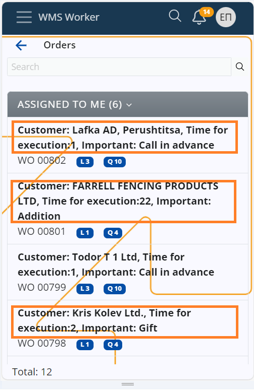

# Modify the displayed information inside a warehouse order

You have the ability to specify exactly what kind of information is displayed on the first line of each of your **orders** in the WMS Worker. Additionally, you can modify the information for fields Product and Location inside the order.

This can be achieved using a **configuration key** specified in an appropriate **[string interpolation](https://docs.erp.net/tech/advanced/string-interpolation/index.html?q=string)** format.

Having access to order data before you even take it allows you to instantly learn what it's about even if a few basic details are provided.

## How to do it

To change the information displayed on the first line of your orders, you need to edit the **/WMS/WMS-Worker/OrderDisplayFormat** config key.

You can learn more about it in the **[Config options reference](https://docs.erp.net/tech/reference/config-options-reference.html#55-wmswms-workerorderdisplayformat)**.

Once you open the key, change its **Key Value** using appropriate **[string interpolation](https://docs.erp.net/tech/advanced/string-interpolation/index.html?q=string)** notation. 

Based on what you provide for **Key Value**, different information will be displayed on the first line of all of your orders in the **WMS Worker**.

For example, in order to keep the worker informed about who the client is (ToParty), Time for execution (@TFEX: V, which is a custom property value) and any important Notes (DocumentNotes), chain these fields into the string and the information will be on top row.

<B> Key Value: Customer: {ToParty}, Time for execution: {@TFEX: V}, Important: {DocumentNotes}</B>

  
The same information is now available not only in the list of orders, but also inside the Warehouse order.

## Customizable data in fields Product and Location

Just the same way users can set which desired information to be at hand in the forementioned fields, inside the warehouse order. Workers can better orient themselves regarding product and location details. Config options put to use are:
<b> #61 WMS/WMS Worker/ProductDisplayTextFormat and #62 WMS/WMS Worker/LocationDisplayTextFormat </b>

### Behaviour in particular cases 

Here is the expected behavior of changing the order display format in certain cases:

•	If there is **no** config key set, the information displayed will be retrieved from the **To Party** field. This is the default behaviour.

•	If there is a key set, but the **Key Value** field is left blank, the displayed information will also be retrieved from **To Party** field.

•	If there is a config key set, but the assigned parameters are **not** returning any value, the displayed information is going to be “-“.
