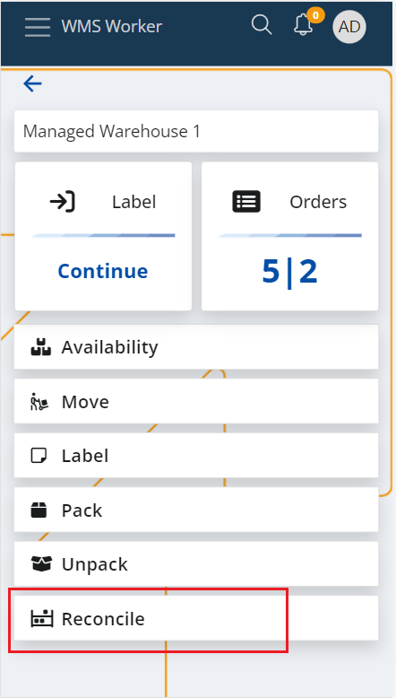
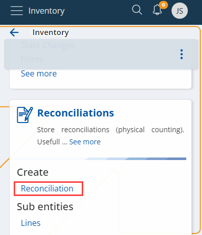
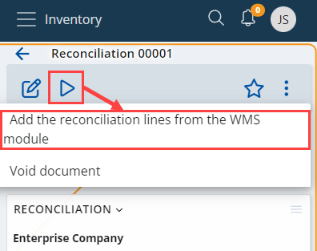
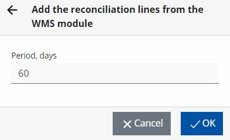
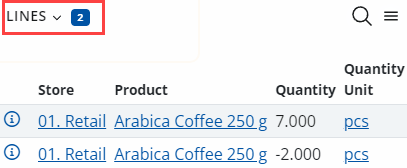

# Reconcile

The reconciliation process in @name is performed in two steps.

First warehouse workers are performing the actual counting of the Warehouse Availability in the Warehouse Locations using the **[WMS Worker](xref:wms-worker) app**. 

The next step is applying the results of the reconciliation made in the WMS module to the Inventory module and its avalability using the Reconcile document and the **Add the reconciliation lines from the WMS module** UI function.

## Reconcile the availability in the Warehouse Location
The first step is to reconcile the availability in the desired Warehouse Location/s.

This step is performed by the warehouse workers that count the availability in the chosen warehouse location/s using their handheld devices and the **[Reconcile menu](xref:reconcile-menu) the [WMS Worker](xref:wms-worker) mobile app**. 

As a result, the app generates Warehouse Transactions with [Count]( /how-it-works/task-types/count.md) task type that adjust the warehouse availability according to the differences that were found during the reconciliation.

The Warehouse Availability in this/these Location/s is now correct, but we still need to update the Availability in the Inventory module.

## Update the availability in the Inventory Module
The next step is to update the Inventory Availability. 

This is performed using the **Add the reconciliation lines from the WMS module** UI function that can be found in the Reconciliation document’s definition. The functions loads all [Count]( /how-it-works/task-types/count.md) Warehouse Transactions that were now yet applied to the Inventory module and creates Reconciliation lines for them. There, these results can be reviewed, edited (if necessary), and applied to the inventory availability by releasing the Reconcile document and generating Store Transactions.

To begin, **create a new Reconciliation document** from the Logistics --> Inventory section.

 
Fill it with the necessary information, including the **Default Store** in which the reconciliation is done, and **Save** the document.

To add reconciliation lines from the WMS module to an existing document, click the **UI Functions button** at the upper-left corner of the screen and then select the **Add the reconciliation lines from the WMS module** option. 

Define the **period** on which you want the data to be based (in days), and click **OK**.

 
This will check which Warehouse Transactions with [Count]( /how-it-works/task-types/count.md) task type haven’t apllied to the Iventory module using Reconciliation documents yet, and will **create lines** for them. 

**Review** and edit (if needed) the results i.e. the created renciliation order lines. Once the review is done, you can **release** the document which will generate **Store Transactions** for the differences and will update the Inventory Availability.
