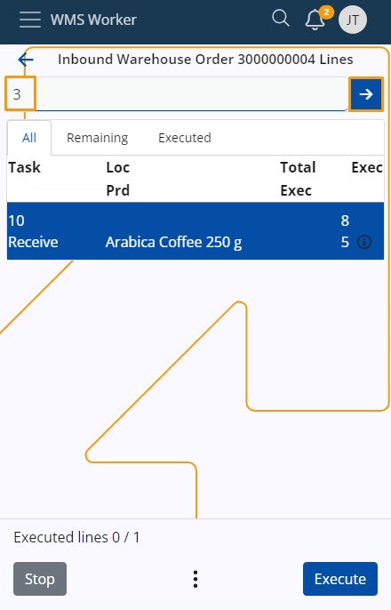
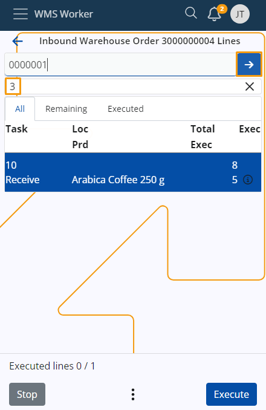

# Use the Scan field

Each time you wish to fulfill an order, you must scan the corresponding product the exact number of times specified by the order quantity.

## Scan an item single time 

To scan a single item, simply enter the product code into the **Scan** field, then proceed by clicking the **blue arrow** button.

> [!NOTE]
> You may be asked to specify the **Location**, **Lot** and **Quantity** before the product is scanned. 
 
## Scan an item multiple times 

To scan an item multiple times, input the desired quantity into the **Scan** field, followed by clicking the **blue arrow** button.

The quantity you input will be displayed in the **quantity** field beneath the **Scan** field. 

Next, enter the product code into the **Scan** field to finalize the operation. 

> [!NOTE]
> You can enhance clarity by adding the multiplication operator "*" after the number in the **Scan** field.

## Adding the number of times a product will be scanned 

When scanning a product multiple times, it might be more convenient in certain situations to input the quantity over several entries.

To do that, enter a number in the **Scan** field and click the **blue arrow** button. Then, repeat the operation one or more times. 

This way, the multiple numbers entered will be summed together, resulting in the final quantity for scanning the product.

> [!NOTE]
>
> **Example: **
> 
> Entering "1*", then "2*", then "3*", and clicking the **blue arrow** button after each number will result in a final quantity of 6 in the quantity box.
