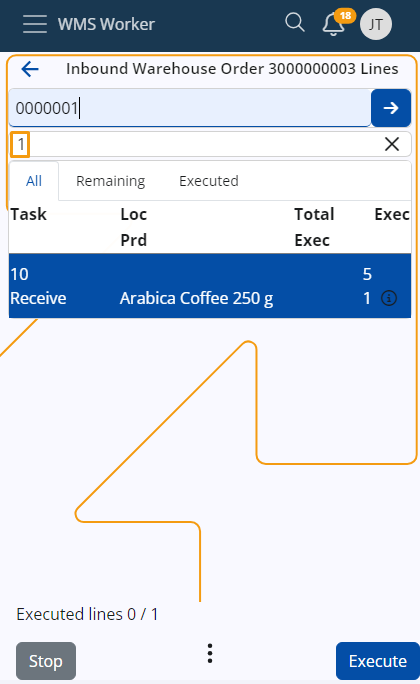

# Enter quantity of one pce

You can configure what happens when you enter a barcode in the WMS Worker app. 

To adjust this setting, use the following **[config options reference](https://docs.erp.net/tech/reference/config-options-reference.html#54-wmswms-workersinglebarcodescanentersquantityofonepce)**:

`/WMS/WMS-Worker/SingleBarcodeScanEntersQuantityOfOnePce`

- When the value of this config is set to "1", scanning of a single barcode is interpreted as 1 PCE.
- When the value is set to "0", the WMS Worker app locates the line and switches to execute mode for that line.

