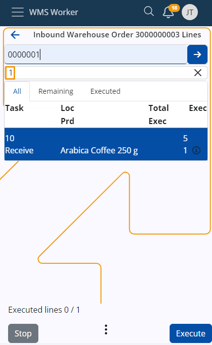

# Enter quantity of one pce

You can decide what the behavior is when entering a barcode.
When scanning a barcode - you can directly enter 1 pce without going through the quantity screen. 
Or when scanning a barcode - just find the row for that product and enter the quantity in the quantity screen.

This setting is accessible by entering a [Config options reference](https://docs.erp.net/tech/reference/config-options-reference.html) - /WMS/WMS-Worker/SingleBarcodeScanEntersQuantityOfOnePce

- When the value of the config is "1", then scanning of a single barcode is accepted as 1 PCE  
- When the value of the config is "0", then the WMS-Worker APP just finds the line and goes to execute mode for this line. 

